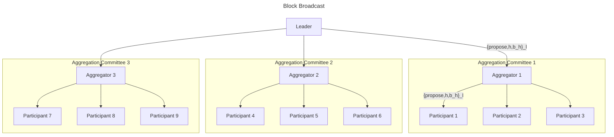
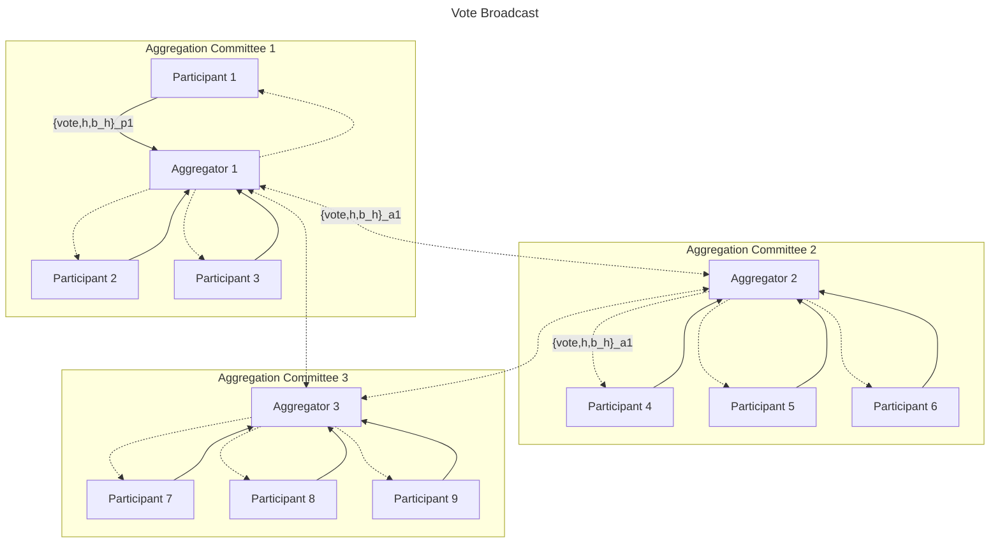
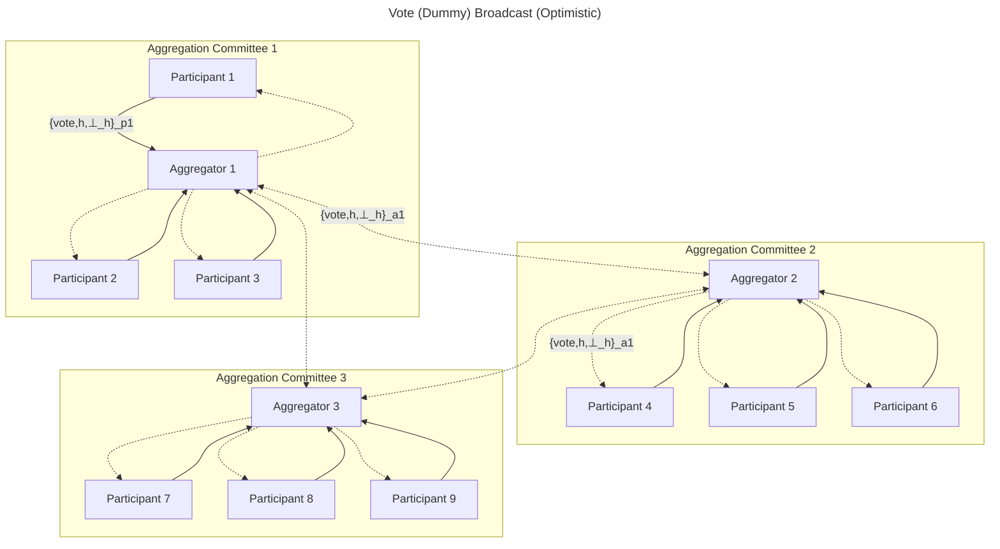
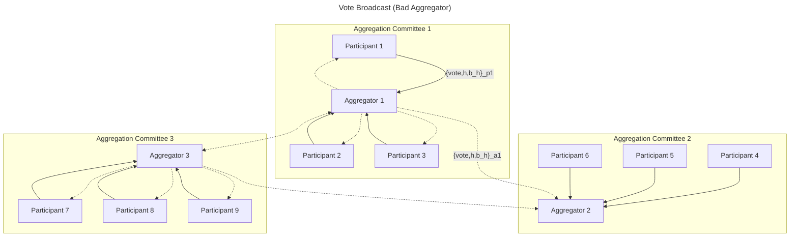
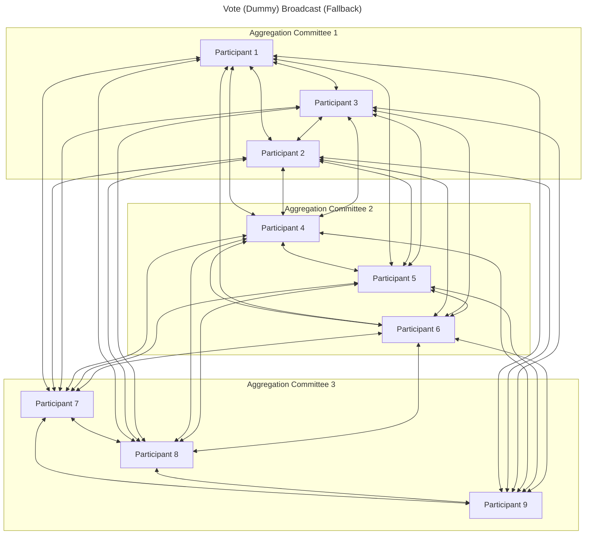

# Vena: Optimistically Responsive Consensus Over Large Validator Sets

> Vena is an optimistically responsive consensus protocol in the partially synchronous network model tailored for deployment on public blockchains with large validator sets. Vena employs a form of "optimistic" aggregation committee broadcast that when successful results in all participants, including the leader, sending less than $n$ messages in a given round. In the uncommon case that this broadcast fails (robustness is parameterizable), Vena falls back to a single, all-to-all broadcast that guarantees eventual progress in the presence of $f < n/3$ static byzantine faults. It is left to future work to construct a formal proof of correctness for Vena.

## Overview

[Simplex Consensus](https://eprint.iacr.org/2023/463), as proposed by Benjamin Y. Chan and Rafael Pass, is an optimistically responsive consensus protocol that tolerates $f < n/3$ static byzantine faults in the partially synchronous network model. While Simplex Consensus "matches the best optimistic liveness bounds, while at the same time matching and even improving the best known pessimistic liveness bounds (both in expectation and in the worst-case)," its application to public blockchains with large validator sets has been limited by its usage of multiple all-to-all broadcasts per round. Chan and Pass suggest that deployment of Simplex Consensus in such environments may be achieved by "subsampling the committee of voters" to reduce the number of messages sent and received by any participant, akin to [Algorand](https://arxiv.org/abs/1607.01341).

To bound the probability of failure on any composed committee ($f >= n_c/3$ where $n_c$ is the size of the committee) to a reasonable level, however, Algorand [parameterizes](https://github.com/algorand/go-algorand/blob/5ac3edcc613e01b0d6f86f008306d931dec08a00/config/consensus.go#L910-L1561) each committee to contain thousands of participants drawn from all "online tokens". For some critical operations, the committees are parameterized to include over $5000$ participants ([which bounds the risk of failure to $< 2^{-40}$ if $f < 0.2873n$ where $n$ is the total population of "online tokens"](#constructing-honest-committees)). This parameterization is made practically efficient by allowing operators that control multiple selected tokens to aggregate their participation using a technique referred to as ["party aggregation"](https://eprint.iacr.org/2023/1273). In a scenario where a large population of operators each own the same number of tokens (where each committee participant in expectation has ~1 selected token), the number of messages sent and received by each participant in each round will still be significant.

Vena is an extension of Simplex Consensus tailored for deployment on public blockchains with large validator sets that retains both optimistic responsiveness and the ability to confirm blocks with a single, honest leader. Vena takes a different approach to scaling participation than that suggested by Chan and Pass. Rather than subsampling the committee of voters, Vena employs a form of "optimistic" aggregation committee broadcast that when successful results in all participants, including the leader, sending less than $n$ messages in each round. We refer to Vena's aggregation committee broadcast as "optimistic" because validators always attempt to use it at least once for broadcast per round, even in some cases where they end up voting for the "dummy" block (the fallback vote after a timeout). Vena remains correct in the presence of $f < n/3$ static byzantine faults unlike alternative protocols that operate over a subsample of the total population of participants ([review the performance of any configuration when $f_p ~= 1/3$](#constructing-honest-committees)).

Aggregation committees, popularized by the [ETH2 Altair Fork](https://eth2book.info/capella/part2/building_blocks/committees/), are some randomly assigned subset of validators that work together to aggregate their communications with a broader network (often by sending messages to other aggregation committees rather than all other participants) to minimize the communication complexity of the broader population of which they are part. Each aggregation committee typically consists of some set of "aggregators" to which all committee members send their messages to. Likewise, each aggregator also pools messages sent by other committees (specifically the aggregators in those committees) and forwards them to all committee members once they have a sufficient stake weight. As long as there exists one honest aggregator in an aggregation committee, messages generated by honest participants in the committee will be forwarded to other aggregators and messages sent to a committee will be forwarded to its participants.

Aggregation committees in Ethereum, to accommodate a now superseded data sharding model and to protect RANDAO, are [tuned to never incur a supermajority byzantine takeover](https://eth2book.info/capella/part2/building_blocks/committees/#target-committee-size). [Vitalik Buterin concluded](https://web.archive.org/web/20190504131341/https://vitalik.ca/files/Ithaca201807_Sharding.pdf) that a minimum committee size of $111$ was required to maintain a $2^{-40}$ probability of a supermajority byzantine takeover, when drawing from an equal weight population that is $1/3$ dishonest. Ethereum opted to use $128$ members because it is the next higher power of 2. Likewise, the [target number of aggregators in each committee is set to 16](https://eth2book.info/capella/part2/building_blocks/aggregator/#aggregator-selection-desiderata) to avoid the scenario where all aggregators in a committee are dishonest. Vena has no such requirements around aggregation committee construction and can recover from any assignment of participants and/or aggregators with a single, all-to-all broadcast.

Vena's capacity to recover from "uncooperative" aggregation committee assignments enables aggressive tuning of the broadcast parameterization to reduce message complexity when the validator set is predominantly honest and online. If things suddenly deteriorate, the all-to-all broadcast fallback ensures safety and liveness will be maintained (as long as there are $f < n/3$ byzantine faults where $n$ is the number of total participants). Optimizing consensus for the "happy path" and falling back to a more expensive but rarely invoked mechanism to recover was inspired by [Frosty](https://arxiv.org/abs/2404.14250), however unlike Frosty, Vena does not require voting to enter an explicit "recovery epoch" nor does it require running a separate consensus protocol in said "recovery epoch" to progress to the next round.

This post concludes with a section that outlines future optimizations for Vena. First, it offers an overview of a streamlined variant of Vena (similar to the streamlined variant proposed in Simplex Consensus) where a $vote$ for $h+1$ is sent in the same message as a $finalize$ for $h$, reducing the number of messages sent in each successful round by $50\%$. This proposed variant, like Vena, does not require consecutive honest leaders to finalize $h$ but does increase confirmation latency. Second, it outlines a mechanism for validators to individually adjust their aggregation committee broadcast strategy based on their observation of network conditions (unseen notarizations included in newly constructed blocks and the dummy block rate). This subjective, out-of-consensus tuning would allow validators to increase aggregation committee robustness even when a standard block cannot be finalized (where a synchronized parameter change or validator eviction could be done). Lastly, it outlines a technique to further reduce message complexity (for very large validator sets) using a multi-layered aggregation committee broadcast where committees can be composed of aggregators who mediate the broadcast to other committees. Vena assumes participant depth of 1, however, this isn't required and could be increased to reduce message complexity at the cost of additional latency.

The deployment of consensus protocols to public blockchains in byzantine environments is rife with complex tradeoffs between communication complexity, confirmation latency, and fault tolerance. Vena explores a favorable balance between these tradeoffs for blockchains with large validator sets. It is left to future work to construct a formal proof of correctness for Vena.

## Protocol Description

_Vena borrows terminology and techniques from [Simplex Consensus](https://eprint.iacr.org/2023/463). It is strongly recommended that you familiarize yourself with the linked work before continuing._

### Assumptions

* Vena is evaluated under the [partial synchrony model](https://groups.csail.mit.edu/tds/papers/Lynch/jacm88.pdf). There exists some upper bound on the message delivery time ($∆$) that is known to all validators, however, this bound only holds after some unknowable but finite "Global Stabilization Time" (GST). The true message delivery time ($δ$) is less than or equal to $∆$ after GST and varies by participant.
* All validators ($n$) participating in consensus for a given height $h$ are static and known by all other validators. The set of validators participating in consensus may change between heights but it does not have to.
* At a given height $h$, there are $f < n/3$ static byzantine faults. Byzantine actors at a given height $h$ can act arbitrarily (i.e. they can deviate from the protocol in any way).
* All validators have equal weight at a given $h$ (assumed to simplify protocol description and analysis but not required for implementation).
* There exists some mechanism that can give a random and unbiased ordering of validators at each height $h$. This mechanism can be run locally and deterministically by any validator.
* Each validator has a known identity. Validators can sign arbitrary messages as this identity and other validators can verify such messages uniquely originated from said validator. In other words, there exists a basic PKI.
* There exists some cryptographic scheme for aggregating signed messages of any subset of validators. This aggregated signature along with a list of the identities that participated can be verified by any validator. It is assumed that this signature and accompanying list of identities is smaller than the concatenation of all aggregated signatures.
* There exists a cryptographic hash function that can be used to hash arbitrary payloads. There is no known attack on this hash function such that 2 payloads with different pre-images produce the same hash.

### Sketch

Vena operates over a chain of blocks where each block is a tuple of $<h, []notarization, parent, payload>$. At a given height $h$, there exists either a "standard" block or a "dummy" block (of form $<h, ⊥, ⊥, ⊥>$) that does not extend the blockchain. $[]notarization$ is an array of notarizations (i.e. a BLS Multi-Signature) each over the hash of some block (either standard or dummy) from $height(parent)$ to $h - 1$, inclusive. The dummy block does not contain a notarization for $h-1$ (if it did, it may not be possible to achieve a quorum with a dummy block vote). $parent$ is the hash of some standard block that the block at $h$ extends. $payload$ is a set of arbitrary bytes contained in the block at $h$ (i.e. transactions).

Vena employs a form of "optimistic" aggregation committee broadcast that when successful results in all participants, including the leader, sending less than $n$ messages in a given round. Each aggregation committee is composed of some subset of validators, of which some smaller subset are given the unique role of "aggregator". Aggregators collect signed messages from members of a committee, aggregate their signatures, and forward aggregated messages to the aggregators of other committees. When receiving messages from other committees, aggregators buffer signatures until there exists $2f + 1$ signatures over a message, at which point the message and aggregate signature are forwarded to all members of the committee the aggregator is assigned.

Validators only belong to one aggregation committee for a given height $h$ and rotate which committee they belong to at each height (can be configured to be stable for longer periods of time). This assignment of validators to aggregation committees is performed using a deterministic and bias-resistant random oracle. One leader is randomly selected per height $h$ to propose a block. The leader is responsible for proposing a block and broadcasting it to the aggregators of all aggregation committees. After broadcast, the leader (who is a member of some aggregation committee but is not an aggregator) behaves as a normal validator.

#### Happy Path

Vena is optimistically responsive (i.e. blocks are finalized at network speed) when there is an honest leader and a "cooperative" aggregation committee assignment. A cooperative assignment exists when a leader's standard block $b$ at $h$ can be (if there exists an honest leader) broadcast to $2f + 1$ honest participants before $3∆$, $2f + 1$ vote messages for $b$ from honest participants reach $2f + 1$ honest participants before $7∆$, and $2f + 1$ finalize messages for $b$ from honest participants eventually reach $2f + 1$ honest participants (timeouts explained in detail later). In other words, a cooperative assignment is simply a round where the constructed aggregation committees provide a functional approximation of multicast.

To see how Vena works in practice, let's first walkthrough this "happy path". To begin, the honest leader first sends a standard block $b$ to the aggregators of all aggregation committees. The aggregators then forward the block to the participants of their committee:



After a block is distributed to all aggregation committees, participants in each committee vote on the block. Participants broadcast their vote messages to the aggregators of their committee. Aggregators aggregate these vote messages and forward the aggregated committee vote to the aggregators of other committees. To retain optimistic responsiveness, aggregators use message weight to determine when to forward messages to other aggregation committees rather than timeouts. Aggregators send an initial aggregate message as soon as they collect an initial message weight, the "Initial Broadcast Weight" ($ib$), and then send some number of additional aggregate messages every "Delta Broadcast Weight" ($db$) they collect. $ib$ and $db$ can be dynamically adjusted based on network conditions and desired tolerance to byzantine faults. When an aggregator has buffered $2f + 1$ vote messages, they forward the aggregated notarization to all participants in their committee and to the leader of $h + 1$ (to ensure they enter the next round within $δ$ of the first honest aggregator):



Upon receiving $2f + 1$ vote messages (referred to as a "notarization" for $h$), the participants in each committee begin voting on $h + 1$ (referred to as "entering the next round") and attempt to finalize the block at $h$. Like before, participants broadcast their finalize messages to the aggregators of their committee. Aggregators aggregate these finalize messages and forward the aggregated finalization to the aggregators of other committees (again once they collect signatures from $ib$ of the stake weight of the committee and then subsequently every $db$). When an aggregator has buffered $2f + 1$ finalize messages, they forward the aggregated finalization to all participants in their committee:


Hooray! The block $b$ is confirmed!

#### Optimistic Dummy Block Vote

In the case that a validator has not seen a block at height $h$ by $3∆$, it will optimistically send a vote for the dummy block via its assigned aggregation committee. Like Simplex Consensus, any honest participant in a given round $h$ will send either a dummy block vote message or a standard block finalize message. As soon as a participant begins the dummy block voting procedure, they will never contribute to finalizing a standard block at $h$. Vena's aggregation committees are considered "optimistic" because validators attempt to use said aggregation committees although there is no proof that they are functional (unbeknown to the validator, the reason they may be voting for the dummy block is because all aggregators are byzantine and they didn't forward the leader's standard block). A useful byproduct of optimistic aggregation committee broadcast is that dishonest leaders cannot force validators to fallback to all-to-all communication by not broadcasting a block in a timely manner.



#### Pessimistic Dummy Block Vote

When all the aggregators for a given committee are dishonest/offline, committee participants may not learn about new blocks, messages sent by committee participants may not be sent to other aggregation committees, they may not receive aggregate messages from other aggregation committees, and/or notarizations may not be sent to the leader at $h + 1$. There can be more than one aggregator assigned to each committee to increase the likelihood there is at least one honest aggregator. The robustness and communication complexity of different aggregation committee configurations is explored in detail in later sections (directly correlated).



If a large number of aggregators are offline or byzantine, the aggregation committee assignment in a round may be "uncooperative" and it may not be possible to produce a notarization for any block at $h$ using aggregation committee broadcast. If a validator has not seen a notarization for some block (standard or dummy) at $h$ by $7∆$, it enters an all-to-all broadcast phase where it sends a vote for the dummy block to all other validators. This broadcast fallback does not require any aggregation committee reconfiguration, opting instead for all validators to "bail out" of a given configuration and try again at $h+1$.



It is possible that a participant may by chance be included in a "run" of faulty aggregation committees and not see a notarization or finalization for some time (potentially much later than other participants especially if almost all other aggregation committees are stable). If this occurs, the participant will stall until it eventually receives a notarization for $h + k - 1$ when receiving a block broadcast at $h + k$ (where $k$ is the number of heights the participant has been stalled). At this time, said participant will backfill the standard block ancestry of $h + k$ and enter $h + k$ (as they would have seen a notarization for $h$ to $h + k - 1$). If there is an honest leader and a cooperative aggregation committee assignment, this will permit $2f + 1$ honest participants to then send vote messages (and eventually notarize) for the standard block $h + k$ (even though they potentially entered $h + k$ long after the leader and/or other participants).

#### Undermining the Next Leader

The leader in round $h$ has $3∆$ (evaluated against the local timer set by the first participant entering round $h$) to distribute a standard block $b$ to $2f + 1$ honest participants for said block to have any chance of being notarized (and eventually included in the canonical blockchain). It takes $∆$ for a standard block $b$ to be sent from an honest leader to all aggregators and $∆$ for honest aggregators to forward the block to all participants in their committee. Thus, an honest leader must enter $h$ within $∆$ of the first honest participant for the standard block they produce to be notarized.

Said differently, if a byzantine adversary of $f$ can force any honest participant to enter round $h$ more than $∆$ before the leader (e.g. they control all aggregators for the committee containing the leader), they can prevent the notarization of a standard block at $h$ produced by an honest leader even if the aggregation committee assignment is cooperative. If repeated, this could allow an adversary to significantly reduce the number of standard blocks included in the canonical blockchain.

The dummy block vote timeout semantics are slightly different in Simplex Consensus (timeout after not seeing notarization rather than after not seeing a block), however, the same potential attack applies. Simplex defends against this by requiring all honest participants that see a notarization for $h - 1$ to "multicast [their] view of the notarized blockchain to everyone else." This ensures all honest participants enter $h$ within $δ$ of the first honest participant (providing enough time to construct a notarization before timeout). Vena could introduce the same mechanism and require all honest participants to send a broadcast to all other participants when they see a notarization for $h - 1$, however, this would arguably defeat the purpose of introducing aggregation committees in the first place (as the "happy path" would no longer operate with sublinear message complexity).

Vena, instead, requires all honest aggregators to forward any notarization they see for $h - 1$ to the leader at $h$ when sending said notarization to all participants in their committee. This ensures that if a notarization is constructed through aggregation committee broadcast that the leader at $h$ will see a notarization for $h - 1$ within $δ$ of the first honest aggregator. Aggregators (assuming a cooperative assignment) are the first honest participants to enter $h$.

If no honest aggregators see a notarization for $h - 1$, it is still possible that the leader at $h$ will not enter $h$ within $∆$ of the first honest participant and a standard block notarization at $h$ will be impossible to construct (even if there is an honest leader and a cooperative assignment at $h$). Consider some aggregation committee assignment where all aggregators across all committees are dishonest but not crashed. They follow the protocol as described previously (forwarding a standard block from an honest leader, aggregating vote messages from their committee, forwarding aggregate vote messages to other committees) but differ in 2 specific flows. Once each aggregator collects $2f+1$ vote messages for $b$, they forward the notarization to all committee participants (unless that participant is the leader in the next round $h+1$) and they do not forward said notarization to the leader at $h+1$ if they are not a committee participant. We later explore how the dummy block rate (especially when a standard block is seen after the timeout) can be used to locally adjust aggregation committee assignment robustness to counteract sudden changes in byzantine participation without a consensus decision (adding more aggregators makes it less likely no honest aggregator will see a notarization if any honest committee participant does).

For completeness, if the aggregation committee assignment is not cooperative, the all-to-all dummy block vote that occurs at $7∆$ also results in an honest leader entering $h$ within $δ$ of the first honest participant. There is a thoughtful analysis of this case in the original Simplex Consensus paper.

#### Handling Conflicting Notarizations

Participants enter round $h + 1$ as soon as they see a notarization for a standard block or a dummy block at $h$, however, they will only finalize $h$ if they see $2f + 1$ finalize messages for a standard block at $h$. Recall, the dummy block never extends the blockchain (and is thus never finalized). A participant may see up to 2 notarizations per height $h$ (one for the standard block and one for the dummy block). If this occurs, the leader of $h + 1$ can choose to include either notarization (may not have seen other at time of block broadcast) and build off of the standard block at $h$ or some earlier standard block (that does not conflict with the finalized tip) as long as they can provide all dummy block notarizations between $height(parent)$ and $h - 1$, inclusive.

### Algorithm

When Validator $p$ enters round $h$:

0. _Start timers:_ $T_s$ = $3∆$ and $T_n$ = $7∆$
1. _Compute a random shuffle over all validators at height $h$:_ $s_h$ =  $Shuffle(h, v_h)$ 
1. _Determine leader for $h$:_ $l_h$ = $s_h[0]$
1. $s_{h+1}$ = $Shuffle(h + 1, v_{h+1})$
1. $l_{h+1}$ = $s_{h+1}[0]$
1. For each committee $i$ ($n_c$ committees of size $n_{cp}$):
    1. _Select $n_{ca}$ aggregators:_ $c_{ia}$ = $v[in_{cp}:in_{cp}+n_{ca}]$
    1. _Select $n_{cp}$ committee participants:_ $c_{ip}$ = $v[in_{cp}:in_{cp}+n_{cp}]$
1. $c_a = \cup_{u=0}^{n_c-1}c_{ia}$ (all aggregators)

If $p \equiv l_h$:

7. Build standard block $b = <h, []notarization, parent, payload>$
1. Send block $b$ to $c_a$

If $p \in c_{ia}$:

9. Upon receiving **first** standard block $b$ from $l_h$, send block to $c_{ip}$
1. Upon receiving $\geq ib$ votes from $c_{ip}$ for some block $q$:
    1. _Initial Vote Broadcast:_ Aggregate $ib$ votes for $q$ and send to $c_a$
    1. _Delta Vote Broadcast:_ For every $db$ vote messages received after initial broadcast, send updated aggregation to $c_a$
1. Upon receiving $2f + 1$ votes for some block $q$:
    1. Construct notarization over $q$ and send to $l_{h+1}$ and $c_{ip}$
1. Upon receiving $\geq ib$ finalize messages from $c_{ip}$ for some block $q$:
    1. _Initial Finalize Broadcast:_ Aggregate finalize messages for $q$ and send to $c_a$
    1. _Delta Finalize Broadcast:_ For every $db$ finalize messages received after initial broadcast, send updated aggregation to $c_a$
1. Upon receiving $2f + 1$ finalize messages for some block $q$:
    1. Construct finalization over $q$ and send to $c_{ip}$

If $p \in c_{ip}$:

14. Upon receiving **first** standard block $b$ from some Aggregator $a \in c_{ia}$, cancel $T_s$ (if not fired):
    1. _Standard Block Vote:_ If have not yet voted for a block in round $h$, send vote for $b$ to $c_{ia}$
1. Upon receiving $2f + 1$ votes for some block $q$, cancel $T_s$ and $T_n$ (if not fired):
    1. _Standard Block Notarization:_ If $T_s$ and $T_n$ have not fired, send finalize message to $c_{ia}$ and enter round $h + 1$
    1. _Dummy Block Notarization:_ Enter round $h + 1$
1. Upon receiving $2f + 1$ finalize messages for standard block $b$, finalize block $b$ (transitively finalize its ancestry)
1. Upon $T_s$ firing:
    1. _Optimistic Dummy Block Vote:_ Broadcast a vote for the dummy block to $c_{ia}$
1. Upon $T_n$ firing:
    1. _Pessimistic Dummy Block Vote:_ Broadcast a vote for the dummy block to $v_h$

_Vena is a [Permissioned Consensus](https://arxiv.org/pdf/2304.14701) protocol and assumes all validators are known and fixed prior to the start of each round (validators can still change between rounds). Aggregator $a$ in a Committee $c$ serves as both an Aggregator and a Committee Participant (also sends its own $vote$ and $finalize$ messages). Leader $l$ is never an Aggregator._

_Participants only broadcast a vote for the first non-dummy block they receive at a given height $h$ that does not conflict with their finalized tip. Observing a block broadcast that conflicts with the finalize tip (under some conditions), observing multiple block broadcasts at a given height $h$, or observing a participant sending a vote/finalize message for conflicting standard blocks at $h$ could be used to apply a penalty (i.e. slashing)._

_Vena participants begin voting for the dummy block as soon as $T_s$ ("standard block timeout") fires. This differs from Simplex Consensus where participants only begin voting after $T_h$ ("notarization timeout"). Simplex Consensus could adopt this technique to reduce the expected round latency for dishonest leaders._

_Initial Broadcast Weight ($ib$) and Delta Broadcast Weight ($db$) are configurable and can be dynamically adjusted based on network stability and desired tolerance to byzantine faults (where less required tolerance can lead to more "dummy blocks" but can reduce message complexity without reducing safety tolerance). When sending a delta weight broadcast, aggregators still send the cumulative aggregated message to other aggregators (not just an aggregation of the signatures received since the last broadcast). This doesn't require extra bandwidth or computation by the broadcasting aggregator and makes tracking aggregated messages easier for the receiving aggregator._

_A cooperative assignment exists when aggregation committees are constructed such that the standard block $b$ can be (if there exits an honest leader) broadcast to $2f + 1$ honest participants before $3∆$, $2f + 1$ vote messages for $b$ from honest participants reach $2f + 1$ honest participants before $7∆$, and $2f + 1$ finalize messages for $b$ from honest participants reach $2f + 1$ honest participants._

_To finalize a standard block $b$ at $h$ (and transitively its ancestry), there must exist some honest leader that enters $h$ within $∆$ of the first honest participant, said leader produces and broadcasts a valid standard block $b$ at $h$, and a cooperative aggregation committee assignment at $h$. While byzantine faults are static, the behavior of any byzantine actor is not. It is possible for some actor to vote honestly for $h$ and then refuse to produce a finalize message for $h$ or aggregate committee finalize messages for $h$ (if an aggregator). If this occurs, a standard block may be notarized at $h$ but never be finalized at $h$._

_The timer to broadcast an optimistic dummy block vote is set to $3∆$ because the latest possible time an honest leader will enter $h$ (if there is at least one honest aggregator that sees a notarization in $h - 1$) is $δ$ (evaluated against the local timer set by the first participant entering round $h$). It will take $2∆ + δ$ to disseminate their standard block to the first honest participant entering round $h$._

_The timer to broadcast a pessimistic dummy block vote is set to $7∆$ because all honest participants in a cooperative assignment in $h - 1$ should enter $h$ within $δ$ of the first honest aggregator in their assigned committee (which should itself be within $δ$ of other aggregators). If there is a cooperative assignment in $h$, it takes $3∆$ (after the $3∆$ timeout) for an optimistic dummy block vote to be communicated over the aggregation committees. This means that the latest a participant should see said notarization is $6∆ + δ$ (evaluated against the local timer set by the first participant entering round $h$). Note, Vena is not optimized for the case where there are a significant number of uncooperative assignments (in this case, aggregator robustness should be increased)._

_It is important that honest participants don't accept standard block votes from other participants that aren't aggregators. Otherwise it would be easier for a byzantine adversary to cause an honest node to enter $h + 1$ more than $∆$ before the leader for $h + 1$._

_Other consensus protocols have reduced latency and/or message complexity in the "happy path" by only sending certain messages to the leader in round $h$ or $h + 1$ (at the cost of worse performance in the "worst case"). Similar changes could be made to Vena by modifying aggregators to send votes to the leader at $h + 1$ and rely on leader to broadcast notarization for $h$ in $h + 1$. There are other complexities of pursuing this approach that are considered future work to explore._

### Optimistic Confirmation Latency

_To make the comparisons in this section easier, we assume all participants enter a given round of consensus at the same time._

With the introduction of aggregation committees, Vena is not (nor does it attempt to be) as fast as Simplex Consensus. However, it is still optimistically responsive when there is an honest leader and a cooperative aggregation committee assignment. On the optimistically responsive path, Vena confirms blocks 2.6x slower than Simplex Consensus ($8δ$ rather than $3δ$). The block time in Vena, on this path, is 1.6x slower than Simplex Consensus ($5δ$ rather than $3δ$).

```text
Block Broadcast:
* [leader] δ broadcast block to committee aggregators
* [aggregator] δ broadcast block to committee participants

Block Vote:
* [participant] δ broadcast vote message to committee aggregators
* [aggregator] δ broadcast aggregate vote message to other committee aggregators
* [aggregator] δ broadcast aggregate vote message to participants

Block Finalize:
* [participant] δ broadcast finalize message to aggregators
* [aggregator] δ broadcast aggregate finalize message to other committee aggregators
* [aggregator] δ broadcast aggregate finalize message to participants

Block Notarized: 5δ
Block Finalized: 8δ
```

_If confirmation latency is more important than message complexity when there is a dishonest leader or aggregation committees are uncooperative, Vena can be configured to avoid optimistic dummy block voting and immediately transition to all-to-all broadcast. This would result in notarization latency of $4∆$ in the "unhappy path" instead of $8∆$ (same as Simplex Consensus)._

Simplex Consensus, for comparison, has the following confirmation latency profile:

```text
Block Broadcast:
* [leader] δ broadcast block to participants

Block Vote:
* [participant] δ broadcast vote message to all other participants

Block Finalize:
* [participant] δ broadcast finalize message to all other participants

Block Notarized: 2δ
Block Finalized: 3δ
```

To better reason about $3δ$ and $8δ$, let us also translate [Snowman Consensus](https://arxiv.org/abs/2404.14250) to this model. Snowman Consensus, like Simplex and Vena, is optimistically responsive and routinely finalizes blocks in ~1.5s over 1800 validators. Confirmation occurs in time $12δ$ assuming that all polls are successful:

```text
k = 20
beta = 20
concurrent polls = 4

* [participant] 2δ poll for preference (block discovery)
* [participant] 2δ poll for preference
* [participant] 2δ poll for preference
* [participant] 2δ poll for preference
* [participant] 2δ poll for preference
* [participant] 2δ poll for preference

Block Finalized: 12δ
```

_In Snowman Consensus, there is no dedicated block broadcast step. Instead, participants poll each other for new blocks and upon learning of one begin to vote on it (after fetching it from the peer that first informed it of its existence). Snowman Consensus collects no voting artifacts from participants and requires an [out-of-protocol mechanism to generate certificates of acceptance](https://github.com/avalanche-foundation/ACPs/blob/main/ACPs/75-acceptance-proofs/README.md) (Vena provides this out-of-the-box)._

### Communication Profile

The communication complexity of Vena (prior to all-to-all broadcast) is primarily dependent on:

* $n_c$: the number of aggregation committees
* $n_{ca}$: the number of aggregators per committee
* $n_{cp}$: the number of participants per committee
* $ib$: the initial broadcast weight
* $db$: the delta broadcast weight

As discussed previously, Vena does not require committees to be supermajority honest for correctness, so committees don't need to contain a significant number of validators. Vena, however, is more sensitive to the number of honest aggregators in each committee as one honest aggregator is required to forward messages between honest participants in different committees and honest aggregators help honest leaders enter the next round in a timely manner. If there are no honest aggregators in a committee (even if all non-aggregators are honest), their messages (outside of a fallback all-to-all dummy block vote) will never reach other validators. Likewise, setting the value of $ib$ too high means that even when there are honest aggregators, aggregation committee signatures will never be forwarded to other committees. Setting the value of $db$ too high means that the number of messages sent by aggregators (not non-aggregators) could far exceed the messages they would send in Simplex Consensus.

We can model the communication complexity of Vena as follows:

```text
c = number of aggregation committees
a = number of aggregators per committee
p = number of participants per committee
b = signature broadcasts (sum of initial and delta broadcasts)

Block Broadcast:
* leader: ca (incoming) + ca (outgoing)
* aggregator: 1 (incoming) + p (outgoing)
* participant: a (incoming)

Block Vote (leaving committee):
* participant: a (outgoing)
* aggregator: p (incoming) + cab (outgoing)

Block Vote (entering committee):
* aggregator: cab (incoming) + p + 1 (outgoing)
* participant: a (incoming)

Block Finalize (leaving committee):
* participant: a (outgoing)
* aggregator: p (incoming) + cab (outgoing)

Block Finalize (entering committee):
* aggregator: cab (incoming) + p (outgoing)
* participant: a (incoming)

Summary (incoming):
* leader: ca
* aggregator: 1 + 2(p + cab)
* participant: a + 2a

Summary (outgoing):
* leader: ca
* aggregator: p + 2(cab + p) + 1
* participant: 2a

Example without Dummy Block (c=32, a=1, p=64, b=1):
* leader (also participant): 32 (incoming) + 32 (outgoing)
* aggregator: 193 (incoming) + 225 (outgoing)
* participant: 3 (incoming) + 2 (outgoing)

Example without Dummy Block (c=32, a=4, p=64, b=1):
* leader (also participant): 128 (incoming) + 128 (outgoing)
* aggregator: 385 (incoming) + 449 (outgoing)
* participant: 12 (incoming) + 8 (outgoing)
```

_It is left to future work to better optimize the broadcast of the block within an Aggregation Committee. As currently specified, each Aggregator will forward the entire block to each Committee Participant._

Simplex Consensus has the following communication profile:

```text
n = number of validators

Block Broadcast:
* leader: n (outgoing)
* participant: 1 (incoming)

Block Vote:
* participant: n (outgoing) + n (incoming)

Notarized View:
* participant: n (outgoing) + n (incoming)

Block Finalize:
* participant: n (outgoing) + n (incoming)

Summary (incoming):
* leader: 3n
* participant: 1 + 3n

Summary (outgoing):
* leader: 4n
* participant: 3n

Example (n=2048):
* leader: 6144 (incoming) + 8192 (outgoing)
* participant: 6145 (incoming) + 6144 (outgoing)
```

_To reduce the message complexity of Simplex, one could batch the notarized view broadcast with the block finalize broadcast on the "happy path"._

Again, to put things in context, let us also represent [Snowman Consensus](https://arxiv.org/abs/2404.14250) in this model. Snowman Consensus, unlike many other consensus mechanisms, only requires an expected constant communication overhead per processing in the "happy path" (when the protocol is not under substantial byzantine attack):

```text
k = number of participants per poll
beta = 20

Block Discovery:
* participant: 1 (outgoing) + 1 (incoming)

Poll for Preference:
* participant: k (outgoing) + k (incoming)

Summary (incoming): 1 + 20k
Summary (outgoing): 1 + 20k

Example (n=2048, k=20):
* participant: ~401 (incoming) + ~401 (outgoing)
```

_We assume all Snowman Consensus polls are successful and symmetric to simplify the analysis._

### Exploring the Tradeoff Between Committee Robustness and Message Complexity

Depending on the desired tolerance to byzantine faults when confirming standard blocks, there are many ways to reasonably compose (where the communication complexity is expected to be less than Simplex Consensus) Vena's aggregation committees. To help explore the tradeoff between robustness and message complexity, we simulate the performance of Vena over a range of possible values of $a$ (the number of aggregators per committee), $ib$ (the initial broadcast weight), and $db$ (the delta broadcast weight) for a given $c$ (the number of aggregation committees) and $n$ (the number of validators). The code for these simulations is included at the end of this write-up and can be modified to explore different settings of $n_c$ and $n$ (which default to $32$ and $2048$, respectively). The simulation is run over 10,000 samples for each configuration and the percentage of cooperative samples (where a standard block is confirmed) is recorded (we always assume the leader is honest). Recall, a failure of a given sample just means that the standard block was not confirmed but does not mean that the protocol stalled (as participants always fallback to all-to-all broadcast).

#### Robustness

##### Aggregators = 1


##### Aggregators = 2


##### Aggregators = 4


##### Aggregators = 8


##### Aggregators = 12


#### Messages

##### Leader


##### Aggregator


##### Committee Participant


## Further Optimization Directions

### Streamlining the Protocol

As noted in the original Simplex Consensus paper:

> To recover a streamlined protocol, it is possible to “piggyback” the finalize message onto the first vote message of the next block; this would only make liveness a little slower, and consistency would still hold.

A similar optimization could be applied to Vena to reduce the number of messages attributable to each round $h$. Unlike many other "streamlined" protocols, this optimization could be introduced without requiring consecutive, honest leaders/healthy aggregation committees to finalize a standard block. To see how this is true, let us consider a scenario where some honest leader broadcasts a block at $h$, $2f + 1$ participants vote for $h$, and the notarization of the standard block $h$ is delivered before $7∆$ (such that $2f + 1$ participants enter $h + 1$ and will never vote for the dummy block at $h$). Now, let us say that the leader elected at $h + 1$ does not broadcast a block (or there is an uncooperative aggregation committee assignment). After $3∆$, $2f + 1$ participants will broadcast a vote for the dummy block at $h + 1$ and will include their finalize for $h$ in the same message. If the dummy block for $h + 1$ is not notarized by $7∆$, these participants will then all-to-all broadcast a vote for the dummy block at $h + 1$ including the same finalize for $h$. The "trick" here is that some block in $h + 1$ (standard or dummy) is always voted upon, whether or not there is an honest leader (allowing $h$, if its notarization is delivered before $7∆$ to $2f + 1$ honest participants, to always be confirmed).

The communication profile of such an approach would look something like:

```text
c = number of aggregation committees
a = number of aggregators per committee
p = number of participants per committee
b = signature broadcasts (sum of initial and delta broadcasts)

Summary (incoming):
* leader: ca
* aggregator: 1 + p + cab
* participant: a + a

Summary (outgoing):
* leader: ca
* aggregator: p + cab + p + 1
* participant: a

Example without Dummy Block (c=32, a=1, p=64, b=1):
* leader (also participant): 32 (incoming) + 32 (outgoing)
* aggregator: 97 (incoming) + 129 (outgoing)
* participant: 2 (incoming) + 1 (outgoing)

Example without Dummy Block (c=32, a=4, p=64, b=1):
* leader (also participant): 128 (incoming) + 128 (outgoing)
* aggregator: 193 (incoming) + 257 (outgoing)
* participant: 8 (incoming) + 4 (outgoing)
```

The described approach to streamlining is not without tradeoffs. Streamlining Vena would increase the confirmation latency for $h$ (as participants would wait to broadcast their finalization for $h$ until they voted for a block at $h + 1$ instead of as soon as they saw a notarization for $h$). There is likely, however, some set of potential deployers of Vena that would trade a further elevated confirmation latency for a meaningful reduction in message complexity.

### Dynamically Adjusting Aggregation Committee Parameterization

As demonstrated previously, there are a number of parameters (all else equal) that have a significant impact on the robustness and communication profile of Vena. It is worthwhile to consider adjusting these parameters based on observed network conditions (e.g. unseen notarizations included in newly constructed blocks, the dummy block rate, the all-to-all fallback rate) to maintain an optimal balance between robustness and message complexity. In essence, why incur additional network overhead to defend against a $30\%$ byzantine adversary if $99.9999\%$ of the time no such adversary exists (recall, safety will always be maintained regardless of aggregation committee robustness)?

A network with less than $10\%$ byzantine participation can almost always confirm blocks with only 1 aggregator per committee (2048 validators, 32 committees, 64 participants per committee):


Likewise, the same can be considered for $ib$ (the initial broadcast weight) and $db$ (the delta broadcast weight) to dynamically adjust the message complexity of Vena based on previously observed committee participation. This should allow the number of broadcasts per aggregator (per vote/finalize) to approach ~1.


When implementing such a feature, it would be wise to avoid relying on standard block finalization to perform a synchronized adjustment to aggregation committee parameterization. Standard block finalization requires a successful aggregation committee shuffle and a large, sudden drop in participation (i.e. AWS outage of $15-20\%$ of validator set) could prevent the finalization of a standard block for hours (even when $2f + 1$ participants are online). Let us sketch an algorithm that each validator can follow to adjust their broadcast robustness independently (agreement on aggregation committee roles never synchronized):

1. Each validator can track network conditions (unseen notarizations included in newly constructed blocks and the dummy block rate) and begin sending messages to more aggregators as network conditions degrade (where each committee member up to some predefined max cardinality has a "rank" for becoming an aggregator).
2. If any eligible aggregator (i.e. has a rank) receives $ib$ weight for some message (and subsequent $db$ weight), it will pass the aggregated message along to other aggregators up to its rank in each committee (rank $1 - aggregator$).
3. When network conditions improve (or malicious validators are evicted), validators can begin sending messages to fewer aggregators (other honest validators will eventually follow suit).

### Multi-Layer Aggregation Committees

To further reduce message complexity (which may be required to support very very large validator sets), Vena could introduce a multi-layer aggregation committee topology. Instead of populating each committee with aggregators and participants, $k$ layers of committees could be populated with "super-aggregators" and "sub-aggregators" where each super-aggregator is responsible for serving the role of an aggregator in a Vena committee and each sub-aggregator is a participant in a given layer and a super-aggregator in a committee one layer deeper. At the lowest layer, committees would contain sub-aggregators as aggregators and some set of participants which serve as neither super-aggregators nor sub-aggregators elsewhere.

Each layer would incorporate committee-based aggregation but instead of forwarding aggregated messages to all other "super-aggregators" at a layer (across committees like in Vena), messages would just be passed to the "super-aggregators" in the parent layer (the committee in $l$ in which the super-aggregator of $l+1$ serves as a sub-aggregator). When at the first layer, messages would be passed to all other aggregators (across committees). This extra relaying per message would increase latency per additional layer introduced.

_If you are interested to learn more about this approach, Vitalik Buterin explored the idea of supporting multiple layers of aggregation a few years ago in ["Paths toward single-slot finality"](https://notes.ethereum.org/@vbuterin/single_slot_finality#What-are-the-issues-with-developing-an-optimal-aggregation-strategy). His high-level construction contemplates how to best integrate layers of aggregation within Ethereum's existing consensus (or a close derivative of it) but generally speaking seeks the same outcome: scaling participation in a single round of consensus to massive numbers of participants._

## Acknowledgements

Thanks to Benjamin Y. Chan (byc@cs.cornell.edu) and Rafael Pass (rafaelp@tau.ac.il) for their novel work on Simplex Consensus. Thanks to Benjamin Y. Chan, in particular, for answering detailed questions about Simplex Consensus and for reviewing numerous pre-release drafts of Vena.

Thanks to [Stephen Buttolph](https://twitter.com/stephenbuttolph) for contributing "Delta Signatures" (to maintain optimistic responsiveness), suggesting to explore the use of multi-layer aggregation committees, for collaborating on "Dynamically Adjusting Aggregation Committee Parameterization", and for catching numerous errata in earlier drafts. He is as much an author of Vena as I am.

Thanks to [Michael Kaplan](https://twitter.com/Michael_Kaplan1) for suggesting that "Delta Signatures" include the aggregation of all messages seen up to $ib + k * db$ weight rather than just $db$ weight.

Thanks to [Aaron Buchwald](https://twitter.com/AaronBuchwald), [Andrew Lewis-Pye](https://twitter.com/AndrewLewisPye), and [Kevin Sekniqi](https://twitter.com/kevinsekniqi) for their feedback during initial Vena research.

Thanks to [Ben Edgington](https://twitter.com/benjaminion_xyz) for publishing [Upgrading Ethereum](https://eth2book.info/capella/), which clearly details how Aggregation Committees work in ETH2.

## Appendix

### Constructing Honest Committees

This simulation code computes the probability that a subsampled committee of size $c_n$ has $c_n * f_c$ faults given an attacker controls proportion $p$ of the validator set. Below, you'll find some example configurations and the code used to reproduce the results. You can read more about this calculation [here](https://eth2book.info/capella/part2/building_blocks/committees/#target-committee-size).

```text
threshold (2^-40)= 9.094947017729282e-13

c_n= 111 f_c= 0.6666666666666666 f_p= 0.3333333333333333 p= 7.70618523410950724734966268675e-13

c_n= 128 f_c= 0.3333333333333333 f_p= 0.25 p= 0.028760674518293299914576387027729554
c_n= 128 f_c= 0.3333333333333333 f_p= 0.2873 p= 0.1774192013558914573970131701826451
c_n= 128 f_c= 0.3333333333333333 f_p= 0.3333333333333333 p= 0.5826316169491489404023714250043237
c_n= 128 f_c= 0.6666666666666666 f_p= 0.3333333333333333 p= 2.24551812442079985690710185445192014e-14

c_n= 512 f_c= 0.3333333333333333 f_p= 0.3333333333333333 p= 0.54149595957599760113175761394716210208503251272797376257099744489446021079973844302322316731358758604771194134091923083108964276840526020404
c_n= 512 f_c= 0.6666666666666666 f_p= 0.3333333333333333 p= 3.32378069652400978955480292288055178838712164885041744671263028924512115703682587968112350529124810166636232971460275141839970844924133039033e-53

c_n= 5000 f_c= 0.3333333333333333 f_p= 0.25 p= 8.87399211806982714803760183787252829673107763616725723433194329141010391018306947168133068916738648678382111118887809738311488508995518101154840893608215041869124574127987220863029211663194419388296031054121965944679752009327917306847431602598482346173765397094251238118178409981832728056466583900887975088889813957335639898539987948979257015934327309823673264306372837522409416436351101294159276964585310287888424447240817211204444919588061944008316223220559086507684650196131133302458172650611663328670904640364747816665732639859326594705164538844591594566762145684179217863397178864191960999231350176394755632972565160279011159481427070121325983258178556067908585769731420551058010563445709204652799795575885196610152170932960939522002720525977833959656068528072726800329049426364736124200015066303843954395687573534554354601009441772756112001852645585977956283265648102854006448324395032017231217642999674596037821066070022862211170134418405791296819948601797457345248588497875808047946165115281253108267602594777487268624775407150007518380800412331130104312846354074166856495763433831983941473976577977625626615759930083720809917488767600193335570330629531072854763633729004796305551261084196433133703012714447105767768206059401735661731359220468329792239639109786295199868336926747935349005872464994497144197139413252378146817950968042314890376899976822858483327639583839775e-40
c_n= 5000 f_c= 0.3333333333333333 f_p= 0.2873 p= 8.60571128660813853480649566082826072260630970588856718333470383702436149863440217472363509491524013599006786364555690022708126380666326119832334792020849016817771101279326866950851504211536575107849419687685178982538752364794820722354607358822244068330763842018401156341209042800024401539819100147389245707921381195996185289357014544674380434897439198235879450413614297734063556596916390793316684351998114803366153173204461989202601284405425345912762665841607041415141398502672495598140829921081978034596575969467354676324071329086368173026230998677773400283946187064312229994678567998078127281059999659715087679622049939737100534284955562106193700324029513520518045644473417587124712586355045241799567500200683388988564752368732928938568928457247094684954792735541817800651394384268924607849190120456653880337581875013226299496700194314651631930015481345463181674728300379284660605883909017113440952310779576163067304801352596400169212411169716563103373885220539909693041099960881687232468833486917804076684270949471807381517203474452005005076177360403486012495563040181585890886961981205890118305891333597191836188733086745043868626382818375679184586072226069196512923787271928657849963891384245797076752190939473112596062866553479955018012092779937654204011412631304168766629958711048247113239849798797301816157104155990866504662282592462445389932714363750536921860046445396304e-13
c_n= 5000 f_c= 0.3333333333333333 f_p= 0.3333333333333333 p= 0.513296089094446886516399044887632088936099787146919219981527037898996284592078279427410882588261430505787513545089150964627384269010981267948676935738018052503875877723166424544126214806892011257130807919263310521023925455549651757970860990339489821046310532500860035700215846783564077523939749917468924340655615451724135100998849681316146359831525430632764234489515048891171834776394590612088827895318564254593736485729650570976937718520195758015922230338999632483948533572954238694265474941335090354773512099280030318966796576784160148421447729060668907692336800444433811579614717798605876309895032264906093264151908442095677404192780723987757508133938771127055992430537584234572405256365186932297302694627438658212750965436442069055258399760783891458273420705094259760964593579122464330397774257793987773998465342814515252601779512654706683851913416011920035079705937250994652351634736454824243742866513959642182391023945798059447822279112155667378365101010221702229536763452134447365661320010180922595546905146457724573998704427124379493750713763900010004580495284924490396960439428687336155911388421506649099038382534632403979307766183059088059905493619984629178822898078723343842743732282437545792099850758890452123499410009209906129805114027012758749820062827532351784704473630104390127864076197400313817163738829359296921041064902792404309397778330609761329839298574769252
c_n= 5000 f_c= 0.6666666666666666 f_p= 0.3333333333333333 p= 4.862786079461605399190533562146698493922068600934085172713368492582869127077516320772684513533194798977011741338051205386138092097237891089925358696098596770851024274566746072285599447938878871499576705939734423671127549517424153453707983028204173684683684429441815317165076170025656857503237512172306914922363894296468380136355269604901577836035065257166933864339537528359342243626259755838599031645218453934945118108602724090609619520652766829465422950652219558795436152036114279943765240025982387882395816234541108962329835046120013388062159251420692487108725350657442573516955529378314418439123282807688056308424396621511816668137998732729983859963872646705141238811730117510280875277128720431271946281505123960223246497863849193429103676808715478783637642152581526063805694324326333893139406781640157832046263508978457516745720339711464915605578205033020229606532364207843560391846081295496122986380766957116189672858008748196648396339657497725606048098928824829884143634450092659568474295722197406524943669945827291996345742830406624706068329307494438943453319735434369838857239665503926213464264628088420866911228347588053191251496231668536656864445205776028445558619635196297066324832744309882428960853450193043726467643372611909514178147181524636837146848723241262014041030136959413151849154676201348093436858744128767970521780387467136799529557672652453109396803362235378e-504
```

```golang
package main

import (
	"fmt"
	"math"
	"math/big"
)

func choose(n, k int64) *big.Int {
	if k > n/2 {
		k = n - k
	}
	b := big.NewInt(1)
	for i := int64(1); i <= k; i++ {
		num := new(big.Int).Mul(big.NewInt(n-k+i), b)
		b = new(big.Int).Div(num, big.NewInt(i))
	}
	return b
}

func pow(v float64, n int64) *big.Float {
	r := new(big.Float).SetFloat64(1)
	for i := int64(0); i < n; i++ {
		r = r.Mul(r, new(big.Float).SetFloat64(v))
	}
	return r
}

func prob(n, k int64, p float64) *big.Float {
	// Compute changes
	a := pow(p, k)
	b := pow(1-p, n-k)
	c := new(big.Float).SetInt(choose(n, k))

	// Compute value
	r := new(big.Float).Mul(a, c)
	r = r.Mul(r, b)
	return r
}

func probge(n, k int64, p float64) *big.Float {
	sum := new(big.Float)
	for i := k; i <= n; i++ {
		sum = sum.Add(sum, prob(n, i, p))
	}
	return sum
}

func main() {
	fmt.Println("threshold (2^-40)=", math.Pow(2, -40))
	for _, sim := range []struct {
		n  int64
		fC float64
		fP float64
	}{
		{111, 2 / 3.0, 1 / 3.0}, // p ~= 2^-40
		{128, 1 / 3.0, 1 / 4.0},
		{128, 1 / 3.0, 0.2873},
		{128, 1 / 3.0, 1 / 3.0},
		{128, 2 / 3.0, 1 / 3.0},
		{512, 1 / 3.0, 1 / 3.0},
		{512, 2 / 3.0, 1 / 3.0},
		{5000, 1 / 3.0, 1 / 4.0},
		{5000, 1 / 3.0, 0.2873}, // p ~= 2^-40
		{5000, 1 / 3.0, 1 / 3.0},
		{5000, 2 / 3.0, 1 / 3.0},
	} {
		fmt.Println("c_n=", sim.n, "f_c=", sim.fC, "f_p=", sim.fP, "p=", probge(sim.n, int64(float64(sim.n)*sim.fC), sim.fP))
	}
}
```

### Evaluating Committee Robustness and Message Complexity

```golang
package main

import (
	"fmt"
	"math/rand"
	"slices"
	"strings"

	"golang.org/x/exp/maps"
	"gonum.org/v1/plot"
	"gonum.org/v1/plot/plotter"
	"gonum.org/v1/plot/plotutil"
	"gonum.org/v1/plot/vg"
)

const (
	samples = 10_000

	validators = 2_048
	committees = 32
)

var (
	aggregators      = []int{1, 2, 4, 8, 12}
	initialBroadcast = []float64{0.25, 0.35, 0.5, 0.65, 0.75}
	deltaBroadcast   = []float64{0 /* no delta broadcast */, 0.05, 0.1, 0.15, 0.2, 0.25}
)

func main() {
	// Determine minimum number of honest participants required to reach consensus (2f+1)
	minHonest := validators*2/3 + 1
	if validators*2/3%100 != 0 {
		// If there was floor division, we need to add 1
		minHonest++
	}

	// Determine committee members
	committeeMembers := validators / committees
	fmt.Printf("Validators: %d Committee Members: %d\n", validators, committeeMembers)
	if validators%committees != 0 {
		panic("validators must be divisible by committees")
	}
	fmt.Printf("Minimum Honest Validators to Finalize: %d/%d (%.2f%%)\n", minHonest, validators, float64(minHonest)/float64(validators)*100)
	fmt.Printf("\n")

	// Graph Messages
	fmt.Printf("Computing Messages Sent\n")
	drawMessages(committeeMembers)
	fmt.Printf("\n")

	// Graph Robustness
	fmt.Printf("Computing Robustness\n")
	results := map[int]map[float64]map[float64]map[float64]float64{} // aggregators -> initial broadcast -> delta broadcast -> byzantine rate -> success
	for _, a := range aggregators {
		results[a] = map[float64]map[float64]map[float64]float64{}
		for _, ib := range initialBroadcast {
			results[a][ib] = map[float64]map[float64]float64{}
			for _, db := range deltaBroadcast {
				results[a][ib][db] = map[float64]float64{}

				// Skip cases where success is impossible
				if skip(ib, db) {
					continue
				}

				// Iterate over byzantine rates
				for byz := 0; byz <= 35; byz++ {
					// Construct participants array
					byzantine := make([]bool, validators)
					count := validators * byz / 100
					for i := 0; i < count; i++ {
						byzantine[i] = true
					}
					byzantineRate := float64(count) / float64(validators) * 100

					// Run samples
					success := 0
					for i := 0; i < samples; i++ {
						// Clone original array to keep each sample independent
						if runRobustness(i, a, ib, db, committeeMembers, slices.Clone(byzantine)) >= minHonest {
							success++
						}
					}
					successRate := float64(success) / float64(samples) * 100
					fmt.Printf(
						"[Aggregators: %d Initial Broadcast: %.2f Delta Broadcast: %.2f] Byzantine: %d/%d (%f%%) Success: %d/%d (%f%%)\n",
						a, ib, db,
						count, validators, byzantineRate,
						success, samples, successRate,
					)
					results[a][ib][db][byzantineRate] = successRate
				}
			}
		}
	}
	drawRobustness(results)
}

func skip(ib, db float64) bool {
	if ib+db >= 1.0 {
		// Delta broadcast never hit (we skip 1 because this is almost identical
		// to not having any delta broadcast over 0% byzantine)
		return true
	}
	if ib <= 2.0/3.0 && db == 0 {
		// No delta broadcast will never work
		return true
	}
	return false
}

// The most messages are sent in the case where all participants are virtuous, so
// we just model that case.
func drawMessages(committeeSize int) {
	// 0 = leader, 1 = aggregator, 2 = participant
	args := [3][]any{}
	for _, aggregators := range aggregators {
		for _, initialBroadcast := range initialBroadcast {
			pts := [3]plotter.XYs{}
			for _, deltaBroadcast := range deltaBroadcast {
				if skip(initialBroadcast, deltaBroadcast) {
					continue
				}

				// Configure number of delta broadcasts
				deltaBroadcasts := 0
				if deltaBroadcast > 0 {
					deltaBroadcasts = int((1 - initialBroadcast) / deltaBroadcast)
				}

				// Compute all
				perLeader := committees * aggregators                                   // block broadcast to aggregators
				perAggregator := committeeSize - aggregators                            // block broadcast to committee
				perParticipant := aggregators                                           // vote broadcast to committee aggregators
				perAggregator += (committees - 1) * aggregators * (1 + deltaBroadcasts) // vote broadcast to other aggregators
				perAggregator += committeeSize + 1                                      // aggregated vote broadcast to committee and next leader
				perParticipant += aggregators                                           // finalize broadcast to committee aggregators
				perAggregator += (committees - 1) * aggregators * (1 + deltaBroadcasts) // finalize broadcast to other aggregators
				perAggregator += committeeSize                                          // aggregated finalize broadcast to committee

				// Skip if number of messages sent by aggregators is way larger than we would ever want
				if perAggregator > validators {
					continue
				}

				// Compute roles
				fmt.Printf(
					"[Aggregators: %d Initial Broadcast: %.2f Delta Broadcast: %.2f (%d)] SM/Leader: %d SM/Aggregator: %d SM/Participant: %d\n",
					aggregators, initialBroadcast, deltaBroadcast, deltaBroadcasts,
					perLeader, perAggregator, perParticipant,
				)
				pts[0] = append(pts[0], plotter.XY{X: deltaBroadcast, Y: float64(perLeader)})
				pts[1] = append(pts[1], plotter.XY{X: deltaBroadcast, Y: float64(perAggregator)})
				pts[2] = append(pts[2], plotter.XY{X: deltaBroadcast, Y: float64(perParticipant)})
			}
			for i := 0; i < 3; i++ {
				args[i] = append(args[i], fmt.Sprintf("AG=%d IB=%.2f", aggregators, initialBroadcast), pts[i])
			}
		}
	}

	// Plot Delta Overhead
	for i, prefix := range []string{"Per Leader", "Per Aggregator", "Per Participant"} {
		p := plot.New()
		p.Legend.Left = false
		p.Legend.Top = true
		p.Title.Text = fmt.Sprintf("[%s] Messages Sent (Validators=%d, Committees=%d)", prefix, validators, committees)
		p.X.Label.Text = "Delta Broadcast"
		p.Y.Label.Text = "Messages"
		p.Y.Min = 0
		if err := plotutil.AddLinePoints(p, args[i]...); err != nil {
			panic(err)
		}
		if err := p.Save(16*vg.Inch, 8*vg.Inch, fmt.Sprintf("messages_%s.png", strings.ReplaceAll(strings.ToLower(prefix), " ", "_"))); err != nil {
			panic(err)
		}
	}
}

func runRobustness(simulation int, aggregators int, initialBroadcast float64, deltaBroadcast float64, committeeMembers int, byzantine []bool) int {
	// Seed with [simulation] to keep results deterministic
	rand := rand.New(rand.NewSource(int64(simulation)))
	rand.Shuffle(len(byzantine), func(i, j int) { byzantine[i], byzantine[j] = byzantine[j], byzantine[i] })

	// Compose committees from participants (assume leader is honest)
	var (
		prev           = 0
		nonAggregators = committeeMembers - aggregators
		weight         = 0
	)
	for i := 0; i < committees; i++ {
		var (
			honestAggregators = 0
			committeeWeight   = 0
		)
		for _, byzantine := range byzantine[prev : prev+aggregators] {
			if !byzantine {
				honestAggregators++
				committeeWeight++
			}
		}
		prev += aggregators
		if honestAggregators == 0 {
			// If there are no honest aggregators, there is nothing left to do or count
			prev += nonAggregators
			continue
		}
		for _, byzantine := range byzantine[prev : prev+nonAggregators] {
			if !byzantine {
				committeeWeight++
			}
		}
		prev += nonAggregators

		// Only add to connectedAndHonest if we have > [initialBroadcast] honest participants and
		// add in intervals of [deltaBroadcast] to simulate delta signatures
		initialWeight := int(float64(committeeMembers) * initialBroadcast)
		if committeeWeight < initialWeight {
			continue
		}
		weight += initialWeight
		if deltaBroadcast == 0 {
			continue
		}
		deltaSize := int(float64(committeeMembers) * deltaBroadcast)
		if deltaSize == 0 {
			panic("delta broadcast too small")
		}
		for counter := initialWeight + deltaSize; counter <= committeeWeight; counter += deltaSize {
			weight += deltaSize
		}
	}
	return weight
}

func drawRobustness(results map[int]map[float64]map[float64]map[float64]float64) {
	for _, aggregators := range aggregators {
		args := []any{}
		for _, initialBroadcast := range initialBroadcast {
			for _, deltaBroadcast := range deltaBroadcast {
				// Skip useless cases
				if skip(initialBroadcast, deltaBroadcast) {
					continue
				}

				// Ensure results are in sorted order
				byzantineResults := results[aggregators][initialBroadcast][deltaBroadcast]
				sortedByzantine := maps.Keys(byzantineResults)
				slices.Sort(sortedByzantine)

				// Compute Successes
				pts := plotter.XYs{}
				for _, byzantineRate := range sortedByzantine {
					pts = append(pts, plotter.XY{X: byzantineRate, Y: byzantineResults[byzantineRate]})
				}
				args = append(args, fmt.Sprintf("IB=%.2f DB=%.2f", initialBroadcast, deltaBroadcast), pts)
			}
		}

		// Plot Broadcast Params over Different Messaging Approaches
		p := plot.New()
		p.Legend.Left = true
		p.Legend.Top = false
		p.Title.Text = fmt.Sprintf("Optimistic Aggregation Robustness (Validators=%d, Committees=%d, Aggregators=%d)", validators, committees, aggregators)
		p.X.Label.Text = "Byzantine Participants (%)"
		p.Y.Label.Text = "Success Rate [10k Samples] (%)"
		if err := plotutil.AddLinePoints(p, args...); err != nil {
			panic(err)
		}
		if err := p.Save(16*vg.Inch, 8*vg.Inch, fmt.Sprintf("robustness_v%d_c%d_a%d.png", validators, committees, aggregators)); err != nil {
			panic(err)
		}
	}
}
```
