# Vryx: Fortifying Decoupled State Machine Replication

> Vryx is an extension of previous research on scaling throughput in the HyperSDK \[[Agreeing on Execution Inputs, Not Execution Results](https://x.com/_patrickogrady/status/1673372491333640192)\] and familiarity with that work, and the open questions it presents, provides useful context around the motivation for this work.

## TODO
* In a system where you want to increase consensus participants without increasing capacity, only allow top N validators to produce chunks
* Just push chunk headers to peers and provide a cached/CDN URL to fetch from a more scalable netwokring layer
* FAQs from feedback (ex: can't enforce a global priority order in a block)

## Overview

Over the last few years, multiple teams have produced experimental results showing that decoupling transaction replication, sequencing, and execution can significantly increase blockchain throughput \[[Flow: Separating Consensus and Compute -- Block Formation and Execution](https://arxiv.org/abs/2002.07403)\]\[[Narwhal and Tusk: A DAG-based Mempool and Efficient BFT Consensus](https://arxiv.org/abs/2105.11827)\]\[[Bullshark: DAG BFT Protocols Made Practical](https://arxiv.org/abs/2201.05677)\]\[[Shoal: Improving DAG-BFT Latency And Robustness](https://arxiv.org/abs/2306.03058)\]\[[Sui Lutris: A Blockchain Combining Broadcast and Consensus](https://arxiv.org/abs/2310.18042)\]\[[BBCA-CHAIN: One-Message, Low Latency BFT Consensus on a DAG](https://arxiv.org/abs/2310.06335)\]\[[Mir-BFT: High-Throughput Robust BFT for Decentralized Networks](https://arxiv.org/abs/1906.05552)\]\[[Mysticeti: Low-Latency DAG Consensus with Fast Commit Path](https://arxiv.org/abs/2310.14821)\]\[[Aleph: Efficient Atomic Broadcast in Asynchronous Networks with Byzantine Nodes](https://arxiv.org/abs/1908.05156)\]. Unlike "traditional" blockchains (like Bitcoin) where syntactically and semantically valid transactions are sequenced, executed, and replicated simultaneously in each block, these decoupled constructions are able to better [pipeline](https://en.wikipedia.org/wiki/Pipeline_(computing)) [State Machine Replication (SMR)](https://decentralizedthoughts.github.io/2019-12-06-dce-the-three-scalability-bottlenecks-of-state-machine-replication) by disseminating, ordering, and verifying transactions independently.

This newly rediscovered approach of "decoupling" State Machine Replication (DSMR), previously detailed by \[[Separating agreement from execution for byzantine fault tolerant services](https://dl.acm.org/doi/10.1145/1165389.945470)\] and \[[BASE: Using Abstraction to Improve Fault Tolerance](https://pmg.csail.mit.edu/bft/rodrigues01base-abstract.html)\] in the early 2000s, is not without tradeoffs. As a consequence of performing replication prior to sequencing and execution, it is no longer possible to enforce semantic verification of replicated transactions. Let us refer to the number of Replicated Transactions Per Second (whether or not fee-paying/executable) as rTPS, the number of Fee-Paying Transactions Per Second as fTPS, and the number of Invalid Transactions Per Second as iTPS (rTPS - fTPS). This means that the fTPS of DSMR constructions can be far less than rTPS, causing participants to waste valuable resources replicating and verifying invalid transactions (iTPS = rTPS - fTPS). **Adversarial issuers (users) employing a mix of cost-effective tactics on a realistic DSMR model can exploit this tradeoff to reduce fTPS to less than 1% of rTPS.**

Vryx, a fortified DSMR construction that will be employed by the [Avalanche HyperSDK](https://github.com/ava-labs/hypersdk) and eventually other Avalanche Virtual Machines, mitigates these adversarial issuance attacks for profit-maximizing builders and ensures that any transactions they replicate must pay fees, restoring fTPS = rTPS. Vryx thus enables the HyperSDK to take full advantage of DSMR pipelining without sacrificing the robustness of traditional SMR, which can enforce full syntactic and semantic verification. Because Vryx only introduces additive constraints to DSMR replication and execution (and does not require any changes to consensus), most of its techniques could be incorporated into previously proposed and adopted DSMR constructions to defend against adversarial users.

> If you prefer long-form video to text, check out the [Vryx Overview on YouTube](https://www.youtube.com/live/0V3YhC6fgtg?si=DedXsQEesbCLEifr) ([Slides](https://docs.google.com/presentation/d/1Qj0USUmKvrU0RgGFVgpMQ1T4JU0pXUROAFZuOtZmrWQ/edit?usp=sharing)).

## Making the Case for Decoupled State Machine Replication (DSMR)

This idea of "decoupling" [State Machine Replication (SMR)](https://decentralizedthoughts.github.io/2019-12-06-dce-the-three-scalability-bottlenecks-of-state-machine-replication) is not new \[[Separating agreement from execution for byzantine fault tolerant services](https://dl.acm.org/doi/10.1145/1165389.945470)\]\[[BASE: Using Abstraction to Improve Fault Tolerance](https://pmg.csail.mit.edu/bft/rodrigues01base-abstract.html)\], however, its study has taken on renewed interest in recent years as different teams have sought to work around bottlenecks in "Traditional" SMR that limit how many Transactions Per Second (TPS) a blockchain can process. In a nutshell, DSMR allows blockchains to better [pipeline](https://en.wikipedia.org/wiki/Pipeline_(computing)) SMR if they are willing to loosen validity expectations on replicated but not yet sequenced or executed data. To be specific, decoupled transaction replication requires the reliable dissemination of transactions to other network participants before full semantic verification can be performed. Semantic verification is not possible because it is unclear how replicated transactions will eventually be sequenced, so the parent state on which they could be verified is not available.

To better understand how pipelining SMR can increase the TPS of a blockchain, let us consider a simple but concrete example where a few validators are attempting to fully process (replicate, sequence, verify) 2 blocks (`A` and `B`). The faster the validators can finish fully processing the 2 blocks, the more transactions they can process per second. This example can be extended to many validators and many blocks but we leave that as an exercise for the reader.

We optionally allow blocks to be chunked into 5 smaller pieces (first 100 txs in chunk 1, next 100 txs in chunk 2, etc.) that can be replicated, sequenced, and verified independently. We use the following notation to describe unique `Actions` over `Blocks` and `Chunks`:

```text
<Action>(<Block>, <Chunk>)
```

We define the following actions:

```text
Build = Create a block chunk from transactions stored locally
Verify = Perform syntactic and semantic verification of a block chunk
Replicate = Disseminate a block chunk to all validators
```

This means that performing a `Build` action over `Block(A)` and `Chunk(2)` would be represented as:

```text
Build(A,2)
```

If we don't use any chunking and instead were to build all of `Block(A)` at once, it would be represented as:

```text
Build(A,1-5)
```

To ensure different approaches to SMR can be compared fairly, we parameterize the time each `Action` takes on a chunk-level as follows:

```text
Build = 2
Verify = 1
Replicate = 4
```

This means that `Build(A,1-5)` would take `t = 10`.

### "Traditional" SMR (No Pipelining)

First, let us consider "Traditional" SMR (TSMR), where replication, sequencing, and execution are performed all-at-once in a block and any transaction in a block is fully verified (syntactically and semantically valid). Each validator builds an entire block before beginning to replicate it. Once a validator receives and verifies a block, it can begin building its own block.

TSMR completes at `t = 70`.


```mermaid
gantt
    title "Traditional" SMR (2 Blocks)
    
    dateFormat x
    axisFormat %L
    
    section Validator(1)
    Build(A,1-5) :done,0, 10
    Replicate(A,1-5) :crit,10, 30
    Verify(B,1-5) :65,70
    
    section Validator(2)
    Verify(A,1-5) :30, 35
    Build(B,1-5) :done,35, 45
    Replicate(B,1-5) :crit,45,65
```

_Note, `Validator(2)` must wait until `t = 35` to build its own block because it ensures that all included transactions are semantically valid (which can only be done once the post-execution state for `Block(A)` is computed)._

### "Streaming" SMR (Some Pipelining)

If we break each block into chunks, we can "stream" (SSMR) parts of a block to other validators while we are still building it. Because we have access to the in-progress state of the block as we chunk and the verifier processes the chunks in order, we do not need to relax our constraint that all sequenced transactions are semantically valid to "stream".

SSMR completes at `t = 30` (**~57.1% less than TSMR**).


```mermaid
gantt
    title "Streaming" SMR (2 Blocks)
    
    dateFormat x
    axisFormat %L
    
    section Validator(1)
    Build(A,1) :done,0, 2
    Replicate(A,1) :crit,2, 6
    Build(A,2) :done,2, 4
    Replicate(A,2) :crit,4, 8
    Build(A,3) :done,4, 6
    Replicate(A,3) :crit,6, 10
    Build(A,4) :done,6, 8
    Replicate(A,4) :crit,8, 12
    Build(A,5) :done,8, 10
    Replicate(A,5) :crit,10, 14
    Verify(B,1) :21, 22
    Verify(B,2) :23, 24
    Verify(B,3) :25, 26
    Verify(B,4) :27, 28
    Verify(B,5) :29, 30
    
    section Validator(2)
    Verify(A,1) :6, 7
    Verify(A,2) :8, 9
    Verify(A,3) :10, 11
    Verify(A,4) :12, 13
    Verify(A,5) :14, 15
    Build(B,1) :done,15, 17
    Replicate(B,1) :crit,17, 21
    Build(B,2) :done,17, 19
    Replicate(B,2) :crit,19, 23
    Build(B,3) :done,19, 21
    Replicate(B,3) :crit,21, 25
    Build(B,4) :done,21, 23
    Replicate(B,4) :crit,23, 27
    Build(B,5) :done,23, 25
    Replicate(B,5) :crit,25, 29
    
    "Traditional" SMR Complete :milestone,70,70
```

_If a verifier (other validator) does not receive a chunk during the streaming broadcast, they may need to fetch it from the builder. This repair process could increase the time required to process these 2 blocks by at least a few network round trips. We ignore this scenario for now but should be considered when implementing SSMR._

### "Decoupled" SMR (Most Pipelining)

If we continue to use chunks but relax the constraint that chunk transactions must be semantically valid when replicated, we can allow validators to build and replicate block chunks concurrently. **Unlike TSMR and SSMR, where the phases of SMR are typically (sequence -> execute -> replicate), this allows us to better orient this sequence to (replicate -> sequence -> execute).** As noted in some of the works referenced above, this new order of SMR is much more compatible with horizontally scalable architecture (where we can keep adding machines to increase the number of transactions we can replicate and that replication can be done independently of any access to state). This also means validators can build a new chunk before they finish verifying chunks for previous blocks. Once receiving all the chunks for a block, assuming each validator produces one chunk per block, we can execute it. We assume there exists some efficient protocol that deterministically sequences chunks replicated by each validator for each block.

DSMR completes at `t = 16` (**~77.1% less than TSMR, 46.6% less than SSMR**).


```mermaid
gantt
    title "Decoupled" SMR (2 Blocks)
    
    dateFormat x
    axisFormat %L
    
    section Validator(1)
    Build(A,1) :done,0,2
    Replicate(A,1) :crit,2,6
    Verify(A,1-5) :6,11
    Build(B,1) :done,5,7
    Replicate(B,1) :crit,7,11
    Verify(B,1-5) :11,16
    
    section Validator(2)
    Build(A,2) :done,0,2
    Replicate(A,2) :crit,2,6
    Verify(A,1-5) :6,11
    Build(B,2) :done,5,7
    Replicate(B,2) :crit,7,11
    Verify(B,1-5) :11,16
    
    section Validator(3)
    Build(A,3) :done,0,2
    Replicate(A,3) :crit,2,6
    Verify(A,1-5) :6,11
    Build(B,3) :done,5,7
    Replicate(B,3) :crit,7,11
    Verify(B,1-5) :11,16
    
    section Validator(4)
    Build(A,4) :done,0,2
    Replicate(A,4) :crit,2,6
    Verify(A,1-5) :6,11
    Build(B,4) :done,5,7
    Replicate(B,4) :crit,7,11
    Verify(B,1-5) :11,16
    
    section Validator(5)
    Build(A,5) :done,0,2
    Replicate(A,5) :crit,2,6
    Verify(A,1-5) :6,11
    Build(B,5) :done,5,7
    Replicate(B,5) :crit,7,11
    Verify(B,1-5) :11,16
    
    "Traditional" SMR Complete :milestone,70,70
    "Streaming" SMR Complete :milestone,30,30
```

_Because we do not execute transactions during "Build" in DSMR, one could argue that it should take less time than the equivalent operation for TSMR or SSMR. We keep it unchanged to make this simple example easier to reason about but in practice this would likely perform even better._

## Attacking DSMR: Can an Adversarial User Cost-Effectively Increase i(nvalid)TPS?

Most of the research into DSMR thus far has explored minimizing the overhead and/or maximizing the robustness of running consensus over artifacts collected during the replication phase of DSMR (typically by linking to previously replicated data when broadcasting new data). Significantly less focus, however, has gone into ensuring that the data these "efficient" DSMR constructions come to consensus over is even executable (or fee-paying). Replicating and sequencing gigabytes of data per second is useless (and even considered a DoS) when it is overwhelmingly invalid.

Unlike TSMR and SSMR, in DSMR it is not possible to semantically verify transactions before or during replication because the state over which a transaction will be applied is not known (i.e. there is not typically a deterministic ordering from the last accepted state/transaction to a transaction about to be replicated like there previously is when building a new TSMR/SSMR block). This means that the number of transactions replicated per second in DSMR is not guaranteed to equal the number of valid (fee-paying) transactions replicated per second. Recall, we refer to the number of Replicated Transactions Per Second (whether or not fee-paying/executable) as rTPS, the number of Fee-Paying Transactions Per Second as fTPS, and the number of Invalid Transactions Per Second as iTPS (rTPS - fTPS). In TSMR and SSMR, iTPS = 0 because all transactions replicated via each block are semantically validated (and any transactions that cannot be are dropped prior to replication). However, iTPS >= 0 in DSMR. When iTPS is 1 or 2 or 3 (i.e. rTPS ~= fTPS), it is not a big deal. Nodes could just skip these invalid transactions and continue on with useful work (as some previously linked papers suggest). However, if it is possible for any user to increase iTPS 10x, 100x, or even 1000x (such that 99%+ of rTPS is invalid), it begins to beg the question of whether it is possible to even achieve the performance theorized above when employing DSMR in an adversarial environment.

> It could be argued that transactions gossiped as part of a best-effort mempool in TSMR or SSMR cannot be semantically verified either and wasting bandwidth on invalid data is not a new issue or one that even uniquely plagues DSMR. However, there is some nuance here: invalid mempool transactions are dropped prior to replication (inclusion in a block) whereas invalid transactions in DSMR consume the typically bounded bandwidth allocated to each machine for replication. If a node is given some limit rTPS of bandwidth to use for distributing transactions, a sufficiently fast machine running TSMR or SSMR that can iterate through a mempool and skip invalid transactions quickly, will fill all of rTPS with fTPS whereas a DSMR construction will not, leading to a lower relative fTPS. Not to mention, the typical coupling of replicated data to consensus in DSMR constructions means pruning invalid data can be much more difficult as it may need to be retained for an extended period of time to ensure safety (as replicated data tends to be linked exclusively by hash in these constructions).

Now that we have defined iTPS and elaborated on how it is uniquely applicable to DSMR, let's consider just how practical it is for an adversarial transaction issuer (user), with no control of stake, to maximize iTPS on a realistic DSMR construction.

### Model Definition: Cool Chain

To evaluate how effectively DSMR can be attacked, let's launch a new blockchain called "Cool Chain" (CC) that employs a realistic DSMR construction with the following configuration:

```text
v = 100 (validators)
c_i = 1 (chunks/second/validator)
c_tx = 1000 (txs/chunk)
c_acct = 4 (txs/account/chunk)
c_d = 2 (chunk inclusion delay)
tx_c = $0.0001 (cost/tx)
```

and the following rules:

```text
* Validators listen for transactions over P2P (no centralized load balancer that routes transactions)
* Validators can include any transaction in a chunk
* Validators include 1 transaction per account per nonce
* Only 1 transaction per account per nonce is executed on-chain
* Fees only paid for semantically valid transactions
* Blocks sequence and execute well-distributed chunks using a black-box consensus construction that irreversibly finalizes all data (no forks)
```

We use the following notation to uniquely describe transactions (if any field is `*`, it can be any value):

```text
tx<Transaction ID>(n<Nonce>)[<Action>]
```

In CC, validators can produce 1 chunk per second of 1000 transactions and there are 100 validators. This means the maximum rTPS of CC is 100k. Transactions use nonces to prevent replay and transaction issuers (users) can submit transactions to any connected builder over P2P (just like in Bitcoin or Ethereum). Validators can include whatever transactions they want in their chunks but only 1 transaction per nonce per account will actually pay fees (if a user replaces a transaction with a higher paying one, both will not be executed). Validators only include 4 transactions from an account in a single chunk and maintain a simple heuristic where they do not include a transaction for an account if they have not previously included transactions with nonces less than the nonce specified by the transaction. Transactions have a fixed fee of $0.0001.

Transaction issuance for CC looks like:

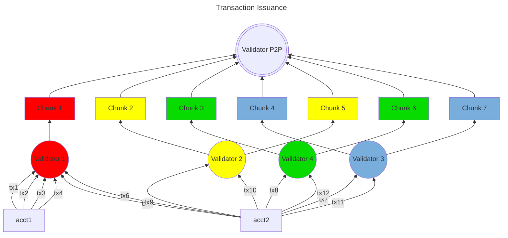
```mermaid
---
title: Transaction Issuance
---
graph BT;
    classDef red fill:#FF0000;
    classDef yellow fill:#FFFF04;
    classDef blue fill:#79ADDC;
    classDef green fill:#07DB00;
    classDef grey fill:#D5D5D4;
    
    c1["Chunk 1"]:::red;
    c2["Chunk 2"]:::yellow;
    c3["Chunk 3"]:::green;
    c4["Chunk 4"]:::blue;
    c5["Chunk 5"]:::yellow;
    c6["Chunk 6"]:::green;
    c7["Chunk 7"]:::blue;

    v1((Validator 1)):::red;
    v1-->c1;
    v2((Validator 2)):::yellow;
    v2-->c2;
    v2-->c5;
    v3((Validator 3)):::blue;
    v3-->c4;
    v3-->c7;
    v4((Validator 4)):::green;
    v4-->c3;
    v4-->c6;
    p2p(((Validator P2P)));
    c1-->p2p;
    c2-->p2p;
    c3-->p2p;
    c4-->p2p;
    c5-->p2p;
    c6-->p2p;
    c7-->p2p;
    
    acct1-->|tx1|v1;
    acct1-->|tx2|v1;
    acct1-->|tx3|v1;
    acct1-->|tx4|v1;

    acct2-->|tx5|v1;
    acct2-->|tx6|v2;
    acct2-->|tx7|v3;
    acct2-->|tx8|v4;
    acct2-->|tx9|v1;
    acct2-->|tx10|v2;
    acct2-->|tx11|v3;
    acct2-->|tx12|v4;
```

Validators take turns building blocks that reference well-replicated chunks. Blocks randomly order replicated chunks (validators do not know in what order the transactions they replicate will be sequenced relative to other validator chunks), only include a chunk once, and are final once proposed (we assume the existence of some efficient consensus implementation). Chunks take 2 seconds to be included in a block (to be well-replicated) and validators do not wait for chunk inclusion to replicate another chunk (they do not know the result of the transactions they previously replicated before replicating more transactions).

Eventually, chunks that are replicated throughout the CC network will be referenced in a block and chunks will be referenced in the order they are built for each validator. If this was not enforced, it would be trivial for anyone building blocks (which sequence chunks) to trivially drive up iTPS by simply sequencing out-of-order chunks for a given validator with transactions that have nonces greater than the executable (latest) nonce for each account.

The CC structure looks like:

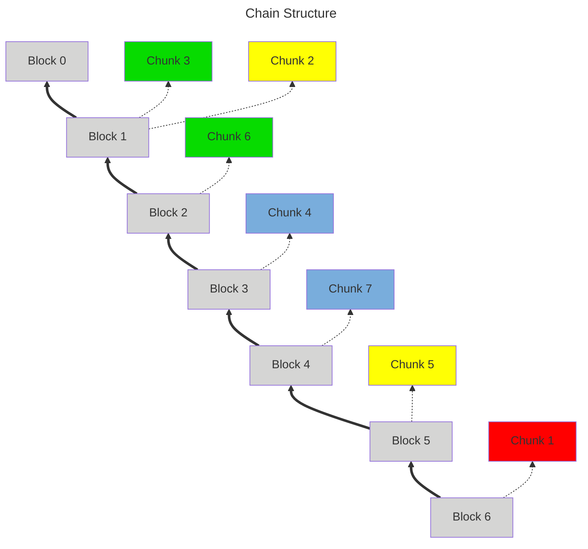
```mermaid
---
title: Chain Structure
---
graph BT;
    classDef red fill:#FF0000;
    classDef yellow fill:#FFFF04;
    classDef blue fill:#79ADDC;
    classDef green fill:#07DB00;
    classDef grey fill:#D5D5D4;
    
    b0["Block 0"]:::grey;
    b1["Block 1"]:::grey;
    b2["Block 2"]:::grey;
    b3["Block 3"]:::grey;
    b4["Block 4"]:::grey;
    b5["Block 5"]:::grey;
    b6["Block 6"]:::grey;

    b6==>b5;
    b5==>b4;
    b4==>b3;
    b3==>b2;
    b2==>b1;
    b1==>b0;
    
    b1-.->c3;
    b1-.->c2;
    b2-.->c6;
    b3-.->c4;
    b4-.->c7;
    b5-.->c5;
    b6-.->c1;
    
    c1["Chunk 1"]:::red;
    c2["Chunk 2"]:::yellow;
    c3["Chunk 3"]:::green;
    c4["Chunk 4"]:::blue;
    c5["Chunk 5"]:::yellow;
    c6["Chunk 6"]:::green;
    c7["Chunk 7"]:::blue;
```

### Attack: Duplicate Transactions

Consider an attack scenario where a transaction issuer sends the same batch of transactions with monotonically increasing nonces to each validator. The transaction issuer has enough funds to pay fees for all included transactions. This issuer's transactions will occupy space in the chunks of all validators but will only be executed in 1 chunk.


```mermaid
---
title: Duplicate Transactions
---
graph BT;
    classDef red fill:#FF0000;
    classDef yellow fill:#FFFF04;
    
    v1((Validator 1)):::red;
    v2((Validator 2)):::yellow;
    
    acct1-->|"tx0(n0)[*]"|v1;
    acct1-->|"tx1(n1)[*]"|v1;
    acct1-->|"tx2(n2)[*]"|v1;
    acct1-->|"tx3(n3)[*]"|v1;
    
    acct1-.->|"tx0(n0)[*]"|v2;
    acct1-.->|"tx1(n1)[*]"|v2;
    acct1-.->|"tx2(n2)[*]"|v2;
    acct1-.->|"tx3(n3)[*]"|v2;
```

If this attack is carried out, we would expect the rTPS to stay constant at 100k but the fTPS to fall to 1k (99% drop). Because fees are only paid for semantically valid transactions, this attack costs $8640 to carry out per day.

```text
[Max fTPS] c_tx = 1000 (-99%)
[Attack Cost Per Day] tx_c * c_tx * 24 * 60 * 60 = $8640
```

[Mir-BFT: High-Throughput Robust BFT for Decentralized Networks](https://arxiv.org/abs/1906.05552) proposes partitioning transactions by their hash (ID) into buckets and uniquely assigning validators to each bucket for a temporary period of time (and then rotating buckets to prevent censorship) to ensure no two validators will include the same transaction in a chunk. **We consider this a reasonable solution to this issue and assume that the CC developers implement this fix. Thus, this attack can be ignored going forward.**

### Attack: Conflicting Transactions

The next attack scenario looks very similar to the duplicate transactions attack but is more difficult to prevent. In this scenario, a transaction issuer sends a unique batch of transactions with monotonically increasing nonces to each validator (think of these as identical transactions with different fee prices). The transaction issuer has enough funds to pay fees for all included transactions. This issuer's transactions will occupy space in the chunks of all validators but will only be executed in 1 chunk.

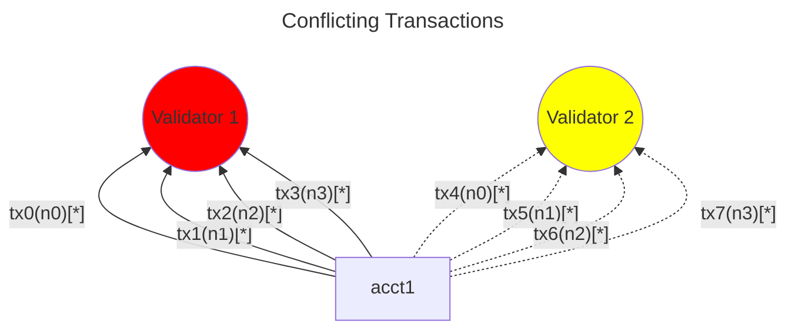
```mermaid
---
title: Conflicting Transactions
---
graph BT;
    classDef red fill:#FF0000;
    classDef yellow fill:#FFFF04;
    
    v1((Validator 1)):::red;
    v2((Validator 2)):::yellow;
    
    acct1-->|"tx0(n0)[*]"|v1;
    acct1-->|"tx1(n1)[*]"|v1;
    acct1-->|"tx2(n2)[*]"|v1;
    acct1-->|"tx3(n3)[*]"|v1;
    
    acct1-.->|"tx4(n0)[*]"|v2;
    acct1-.->|"tx5(n1)[*]"|v2;
    acct1-.->|"tx6(n2)[*]"|v2;
    acct1-.->|"tx7(n3)[*]"|v2;
```

If this attack is carried out, we would expect the rTPS to stay constant at 100k but the fTPS to again fall to 1k (99% drop). Because fees are only paid for semantically valid transactions, this attack costs $8640 to carry out per day.

```text
[Max fTPS] c_tx = 1000 (-99%)
[Attack Cost Per Day] tx_c * c_tx * 24 * 60 * 60 = $8640
```

_Although not applicable in this account-based model, the same attack would work for a UTXO-based blockchain if conflicting txs are sent to different validators (each UTXO behaves like an account nonce)._

### Attack: Fund Exhaustion

In this scenario, a transaction issuer sends a batch of transactions with monotonically increasing nonces to a validator. In the first transaction, the issuer sends all of the account's funds to another account they control. The first transaction in this run of transactions can be executed but the remaining are not executable (do not have funds to pay fees).

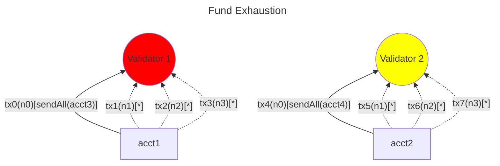
```mermaid
---
title: Fund Exhaustion
---
graph BT;
    classDef red fill:#FF0000;
    classDef yellow fill:#FFFF04;
    
    v1((Validator 1)):::red;
    v2((Validator 2)):::yellow;
    
    acct1-->|"tx0(n0)[sendAll(acct3)]"|v1;
    acct1-.->|"tx1(n1)[*]"|v1;
    acct1-.->|"tx2(n2)[*]"|v1;
    acct1-.->|"tx3(n3)[*]"|v1;
    
    acct2-->|"tx4(n0)[sendAll(acct4)]"|v2;
    acct2-.->|"tx5(n1)[*]"|v2;
    acct2-.->|"tx6(n2)[*]"|v2;
    acct2-.->|"tx7(n3)[*]"|v2;
```

This attack proceeds in runs of `(c_d+1)` where the first transaction included in the first chunk sends all fees but the builder is still willing to include up to `c_acct` txs in the subsequent 2 chunks because they do not yet know the account can no longer pay fees. While the attack is less effective than the previous 2 if the `c_acct` limit is respected, it is much worse if `c_acct = c_tx`.

```text
[Max fTPS (c_acct=4)] (c_tx/c_acct * v)/(c_d+1) = 8333 (-91%)
[Attack Cost Per Day (c_acct=4)] tx_c * (c_tx/c_acct * v) * 24 * 60 * 60/(c_d+1) = $72,000

[Max fTPS (c_acct=c_tx)] v/(c_d+1) = 33 (-99.96%)
[Attack Cost Per Day (c_acct=c_tx)] tx_c * v* 24 * 60 * 60/(c_d+1) = $288
```

### Attack: Combining Conflicting Transactions and Fund Exhaustion

If the conflicting transaction attack is combined with fund exhaustion, the transaction issuer sends a unique batch of transactions with monotonically increasing nonces to each validator. However, only the first transaction in the batch is executable. This issuer's transactions will occupy space in the chunks of all validators but only the first transaction will be executed in 1 chunk.

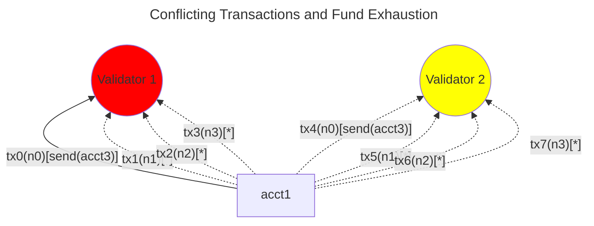
```mermaid
---
title: Conflicting Transactions and Fund Exhaustion
---
graph BT;
    classDef red fill:#FF0000;
    classDef yellow fill:#FFFF04;
    
    v1((Validator 1)):::red;
    v2((Validator 2)):::yellow;
    
    acct1-->|"tx0(n0)[send(acct3)]"|v1;
    acct1-.->|"tx1(n1)[*]"|v1;
    acct1-.->|"tx2(n2)[*]"|v1;
    acct1-.->|"tx3(n3)[*]"|v1;
    
    acct1-.->|"tx4(n0)[send(acct3)]"|v2;
    acct1-.->|"tx5(n1)[*]"|v2;
    acct1-.->|"tx6(n2)[*]"|v2;
    acct1-.->|"tx7(n3)[*]"|v2;
```

Like the previous attack, this attack proceeds in runs of `(c_d+1)`. This attack reduces fTPS by 99.91% if `c_acct` is respected and 99.999% if it is not, either of which is particularly concerning given a cost of attack of $720 and $2.88 on CC.

```text
[Max fTPS (c_acct=4)] (c_tx/c_acct)/(c_d+1) = 83 (-99.91%)
[Attack Cost Per Day (c_acct=4)] tx_c * (c_tx/c_acct) * 24 * 60 * 60/(c_d+1) = $720

[Max fTPS (c_acct=c_tx)] 1/(c_d+1) = 0.33 (-99.999%)
[Attack Cost Per Day (c_acct=c_tx)] tx_c * 24 * 60 * 60/(c_d+1) = $2.88
```

### Aftermath: Indefinitely Persisting Invalid Transactions

When a new node joins CC, it must fetch and execute all previously accepted chunks to perform consensus (recall, consensus is usually performed over the artifacts of reliable broadcast of previously replicated data) and generate the current state. While CC plans to offer state sync functionality for nodes that do not need to reprocess all historical transactions (and are willing to accept that the current state is valid if a supermajority of stake does), data providers, explorers, and exchanges still desire to ingest all finalized, valid transactions from genesis onward to offer products and services on CC. When the % of iTPS exceeds 99%, this leads to a significant amount of both storage and bandwidth overhead for anyone either serving historical data or receiving it. **When the rate of iTPS approaches 99% of rTPS, nodes need to store/disseminate a kilobyte of data for every byte of valid/useful data.**

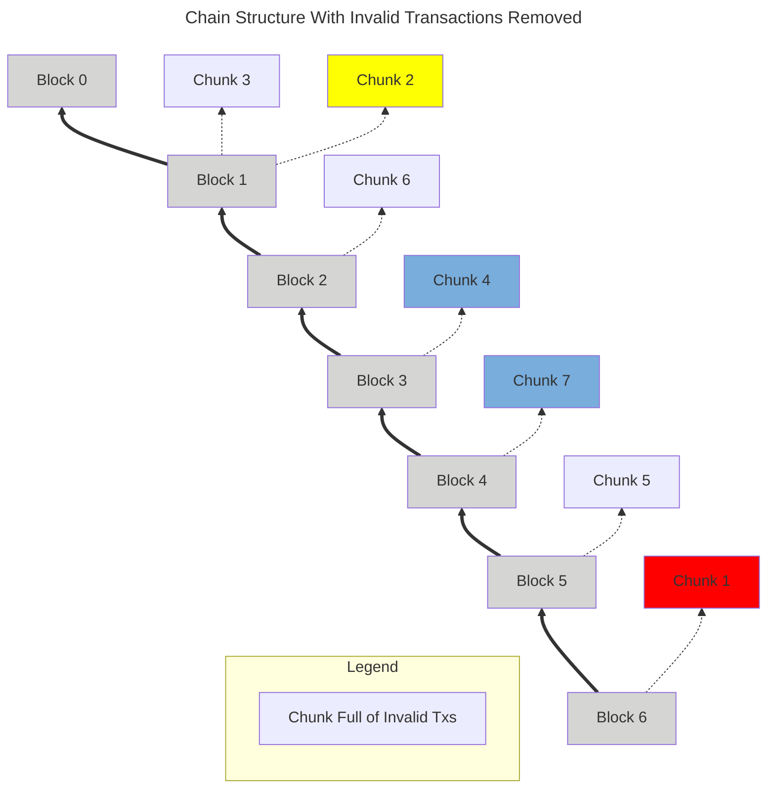
```mermaid
---
title: Chain Structure With Invalid Transactions Removed
---
graph BT;
    classDef red fill:#FF0000;
    classDef yellow fill:#FFFF04;
    classDef blue fill:#79ADDC;
    classDef green fill:#07DB00;
    classDef grey fill:#D5D5D4;
    
    b0["Block 0"]:::grey;
    b1["Block 1"]:::grey;
    b2["Block 2"]:::grey;
    b3["Block 3"]:::grey;
    b4["Block 4"]:::grey;
    b5["Block 5"]:::grey;
    b6["Block 6"]:::grey;

    b6==>b5;
    b5==>b4;
    b4==>b3;
    b3==>b2;
    b2==>b1;
    b1==>b0;
    
    b1-.->c3;
    b1-.->c2;
    b2-.->c6;
    b3-.->c4;
    b4-.->c7;
    b5-.->c5;
    b6-.->c1;
    
    c1["Chunk 1"]:::red;
    c2["Chunk 2"]:::yellow;
    c3["Chunk 3"];
    c4["Chunk 4"]:::blue;
    c5["Chunk 5"];
    c6["Chunk 6"];
    c7["Chunk 7"]:::blue;

    subgraph Legend
        cI["Chunk Full of Invalid Txs"]
    end
```

_CC developers could decide to filter transactions offline and store them in AWS S3 or some other cloud database to enable partners to stand up such services but the CC developers are concerned that offering unverifiable access to historical data sets puts them in a privileged position to manipulate data (even if unintentional). They would prefer to avoid this layer of trust. There is a separate conversation to be had about offering historical access to blocks in high-throughput blockchains without imposing large storage constraints on nodes but that will be addressed later in this work._

### Cool Chain Adds Dynamic Fees: Incentivizing Attack

As CC becomes more popular (possibly only before adversarial users attempt the attacks previously outlined), users begin to utilize all available bandwidth with their transactions. The CC community decides that they don't want to increase the amount of available blockspace, as that would require all validators to purchase more powerful hardware and networking equipment, but they want to allow users to pay to prioritize the inclusion of their transactions instead of using a FIFO inclusion mechanism (which discourages spamming on the P2P layer and better rewards validators for running CC).

The CC developers, like most blockchains, determine that the minimum fee price should rise and fall based on the amount of valid transactions finalized by CC (fTPS). They opt against basing the mechanism on rTPS because it then becomes trivial for CC validators to drive up fees on the network by including useless transactions to increase their revenue without paying fees to do so.

At first, things go as planned and the minimum fee price rises and falls during periods of high and low activity. Little do they know, the CC developers have just incentivized the attacks previously discussed. Some adversarial users who aren't particularly time-sensitive (they don't care when their transaction is included on-chain, just that it is) used to be able to submit transactions at a very low fee price are now forced to pay a higher fee price to perform the same activity. These users begin to wonder what can be done about this and realize they can use the methods mentioned above to saturate rTPS with invalid transactions. This causes the minimum fee price to fall (and in the process dramatically lowers fTPS at the same rTPS), allowing them to once again submit transactions at the lower fee price they are used to.

## Mitigation Strategy: Enable Profit-Maximizing Builders to Minimize i(nvalid)TPS

The most straightforward fix to prevent the previously discussed attacks on blockchain DSMR would be to somehow find a way to restore the property that transactions can be semantically validated prior to replication. As long as transaction ordering is not known prior to replication, however, this is not possible. If we begin to skew this line (and require ordering somehow be done prior to replication), our modified DSMR becomes increasingly similar to SSMR and we lose the performance advantage (in this case more TPS) we get from better pipelining SMR. Let's see what we can do if we continue to accept this tradeoff (that transactions cannot be semantically validated prior to replication).

If we were willing to funnel transaction broadcast through some sort of centralized load balancer, we could rely on a trusted sequencer that ingests all transactions from users, orders them, validates them, and then distributes them to builders for DSMR. DSMR builders would trust this sequencer to only distribute a transaction once and to drop any conflicting transactions or transactions that couldn't be executed (because the account exhausted all funds). DSMR builders would also trust that anything issued by this sequencer would eventually be executed on-chain in order to ensure that transactions they were given by the sequencer could be executed (this is required to ensure everything distributed by the sequencer could be executed, otherwise txs that would have been valid may no longer be as in the case where a spend of funds is executed but not the deposit of funds). This approach "works" but raises concerning questions about censorship, robustness, and trust if a centralized overlay is required to make DSMR work well in adversarial environments.

A different approach to mitigating these attacks is coupling profit-maximizing heuristics with additional constraints on replication and/or execution that enforce said heuristics. A solution that might be more tenable, if we are willing to partition each account exclusively to a single builder and enforce that transactions specify how many fee-paying tokens they can spend ([similar to what is required in the EVM and used to prevent mempool DoS](https://github.com/ethereum/go-ethereum/pull/26648)), would be using an off-chain heuristic where builders issue one transaction at a time (or some number of transactions that spend less than an account's total balance in the last accepted state) and ensure that any transactions they replicate are not duplicates and do not conflict with previously replicated transactions. It would be possible for profit-maximizing builders (trying to maximize their fee revenue) to achieve iTPS = 0 for their replicated data without reliance on semantic validation prior to replication as long as transactions bound for one account can't be executed by another (and if transactions bound for one builder but replicated by another are just dropped), builders that each account are bound to never need to be rotated (their staking period never ends), and bounded builders never censor transactions. However, this approach is not realistic because it is almost certainly a requirement to periodically rotate account-builder relationships to avoid prolonged censorship and because builders in any production network eventually enter/exit the active set. This means that there would likely need to exist some timeout where replicated but not yet sequenced or executed transactions could be processed and then issuance for an account could resume again from a newly bound builder. Any sort of overlap of issuance could lead to spikes of invalid transaction inclusion in the presence of adversarial users. This combination of additional replication/execution phase constraints and heuristics that profit-maximizing builders can follow is an interesting direction but the inefficiency of the account-builder rotation and bounding to a single builder are undesirable constraints for a production-level rollout but seem to perform better at first glance than transaction-based partitioning when mitigating attacks on CC.

If we were additionally willing to introduce some notion of a slashable bond for each account that disburses some amount of funds that is greater than or equal to the fee paid to execute a transaction to the builder that replicated it, we can avoid a "freeze" when rotating account-builder relationships (as replicating transactions without a balance tracking heuristic would not result in iTPS > 0 if the account that issued the transaction cannot pay fees). If we make it impossible to issue conflicting transactions by removing nonces for each account and uniquely partition accounts (and optionally sub-partition account-transactionID) slices to specific builders, we can ensure that no bond can be claimed by multiple builders. Builders, if profit-maximizing, would not sequence transactions that they are not assigned to replicate (and will not generate fee revenue from). Like the last paragraph, this brings us to a place where the attacks on CC are no longer possible because builders are assured that the transactions they replicate, when following heuristics, must pay them transactions fees. Fortunately, this approach is more compatible with realistic requirements of a production system (the periodic rotation of builders). **Note, ensuring fTPS = rTPS for profit-maximizing builders does not require any change to the consensus/sequencing SMR phase. This means that, at least in the construction described below, that these ideas are consensus-agnostic and can be applied to many existing DSMR constructions, which prescribe little about replication or execution constraints.**

It is important to note that any construction that relies on off-chain heuristics to be followed by profit-maximizing builders will not prevent invalid transactions from being replicated but as long as there is some mechanism for pruning data replicated by builders that do not follow these heuristics (their data is iTPS > 0), this may be a reasonable compromise given the performance that DSMR provides over TSMR or SSMR, especially if the number of non-compliant builders is reasonably small. If not, the % of iTPS across the network as a whole may not end up achieving a higher fTPS than optimized SSMR. We can describe this tradeoff as follows:

```text
d_tps = Max TPS of DSMR construction with no adversarial users
c_db = Number of compliant DSMR builders
t_db = Number of DSMR builders
s_tps = Max TPS of SSMR construction

d_tps * c_db/t_db > s_tps?
```

If the max capacity of a DSMR construction far exceeds SSMR (which is usually the case because it is easier to scale out DSMR replication), it may require `c_db/t_db << 66%`.

## Introducing Vryx: Fortifying Decoupled State Machine Replication

Vryx, a fortified DSMR construction that will be employed by the [Avalanche HyperSDK](https://github.com/ava-labs/hypersdk) and eventually other Avalanche Virtual Machines, empowers profit-maximizing builders (seeking to maximize the amount of fee revenue they collect from transaction inclusion) to ensure data replicated via DSMR has iTPS = 0 through the use of account fraud proofs, temporal account partitioning, and nonce-less transactions. To protect against builders who opt to replicate data that is invalid, Vryx also introduces a zero-overhead, deterministic filtering mechanism that participants run after execution to remove invalid transactions from the canonical chain to prevent the indefinite persistence and replication of useless data to support new participants joining the network. As a byproduct of this design (and specifically a result of persisting hashes of all filtered data to a chain that can be synced without access to any replicated data), Vryx also makes it efficient to verifiably sync historical data using cloud-native services instead of from other nodes on the network (whose bandwidth may be better utilized on processing pending transactions). **While Vryx is a specific implementation of DSMR optimized for the HyperSDK, its approaches can be abstracted into a collection of high-level techniques that other DSMR constructions could add to their own implementations assuming the validator set is known at a particular height, validators have some cryptographic identity (preferably one that is aggregatable), and the execution model is account-based.**

In the following sections, we explain how each of these features works and then walkthrough how they protect Cool Chain (CC) from the attacks we previously analyzed. We will then show how Vryx will be integrated with an instance of the HyperSDK running on Snowman Consensus, which goes to show how Vryx enforces few expectations on how replicated data is sequenced. When integration with the HyperSDK is complete, a set of reproducible benchmarks will be published that analyze the performance of Vryx under different scenarios (including the attacks previously discussed).

### Account Fraud Proofs

To ensure any transaction replicated by a profit-maximizing builder pays fees, we introduce a notion of claimable bonds using account fraud proofs. In Vryx, each account must lock up some amount of funds (upon creation) that can be claimed by any builder that replicates a transaction that an account cannot pay fees for. The act of including an invalid transaction other than not having sufficient funds to pay fees in replicated data serves as a fraud proof. Any account (user) has full visibility of their issued transactions and can ensure that they have funds to cover the execution of all transactions they broadcast. The size of the bond locked by each account determines how many transactions builders allow to be in-flight, as the funds an account has to pay fees could be exhausted at any point and they will rely on the bond to cover their loss. Rather than requiring accounts to maintain a fee balance and a spend balance, the bond approach does not require accounts to top up their bond unless they want to increase the number of transactions they can issue at any time, avoiding a tedious UX impairment. While locking funds of an amount representing many transaction fees may seem like an onerous requirement, consider that the benefits of employing DSMR should expand the capacity far beyond what is possible with TSMR or SSMR and thus drive down the transaction fee that must be paid per transaction to levels such that this only requires a few USD at most but may require far less.

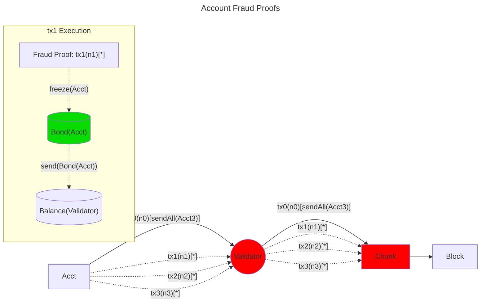
```mermaid
---
title: Account Fraud Proofs
---
graph LR;
    classDef red fill:#FF0000;
    classDef yellow fill:#FFFF04;
    classDef green fill:#07DB00;
    
    v1((Validator)):::red;
    c1[Chunk]:::red;
    b1[Block];
    ab[("Bond(Acct)")]:::green;
    vb[("Balance(Validator)")];
    
    Acct-->|"tx0(n0)[sendAll(Acct3)]"|v1;
    Acct-.->|"tx1(n1)[*]"|v1;
    Acct-.->|"tx2(n2)[*]"|v1;
    Acct-.->|"tx3(n3)[*]"|v1;
    
    v1-->|"tx0(n0)[sendAll(Acct3)]"|c1;
    v1-.->|"tx1(n1)[*]"|c1;
    v1-.->|"tx2(n2)[*]"|c1;
    v1-.->|"tx3(n3)[*]"|c1;
    
    c1-->b1;
    
    t1["Fraud Proof: tx1(n1)[*]"];
    subgraph tx1 Execution
        t1-. freeze(Acct) .->ab;
        ab-. send(Bond(Acct)) .->vb;
    end
```

If an account cannot pay the fees for a replicated transaction, the account becomes locked and part of the bond is distributed to any builder that included their transaction. Just like when an account was originally created, another account can fund a frozen account so that they can submit transactions again. Accounts that are fraud proven are not deleted because they may hold assets of value far greater than their bond and the root cause of invalid issuance may have been an honest mistake, albeit a mistake that no builder should suffer from. Once bonded, an account cannot withdraw their funds as builders rely on the locked nature of these funds (and a delayed view of them during replication) to justify their inclusion of transactions before they know they will be compensated for such work.

_See [Account Abstraction Compatibility](#account-abstraction-compatibility) for an exploration of how you could rotate signing credentials on an account instead of transferring funds to a new account and paying a new bond._

#### Temporal Account Partitioning and Nonce-less Transactions

Vryx enables builders to track the liabilities of any account (number of in-flight transactions) by partitioning transactions by account to specific builders. Vryx can optionally be configured to further sub-partition each account by transaction ID to provide additional censorship resistance and better load balancing for active accounts. In this parameterization, the account bond described previously is divided by all valid builders when limiting in-flight transactions. Transactions only replicated by correct builders will be executed, so profit-maximizing builders do not need to fear that other builders can cause them to replicate invalid transactions if they were to include arbitrary transactions.

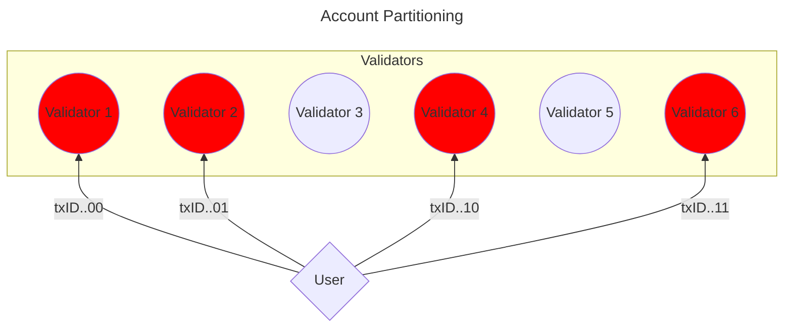
```mermaid
---
title: Account Partitioning
---
graph BT;
    classDef red fill:#FF0000;

    subgraph Validators
        v1((Validator 1)):::red;
        v2((Validator 2)):::red;
        v3((Validator 3));
        v4((Validator 4)):::red;
        v5((Validator 5));
        v6((Validator 6)):::red;
    end
    
    user{"User"};
    user-->|txID..00|v1;
    user-->|txID..01|v2;
    user-->|txID..10|v4;
    user-->|txID..11|v6;
```

Partitioning transactions on a long-lived rotation is not particularly complex and can be done with a basic [PRNG](https://en.wikipedia.org/wiki/Pseudorandom_number_generator) over any known set but continuously re-partitioning transactions over short-lived rotations without impacting throughput is a bit more challenging. Recall, re-partitioning accounts over builders is important for providing censorship resistance (even when sub-partitioned, it may not be possible to issue some transactions) and for staking set rotations (when builders are either evicted and can no longer replicate transactions or are added and can now replicate transactions).

To make these re-partition operations efficient, we introduce the notion of a nonce-less transaction for an account-based blockchain where replay protection is provided by the transaction ID over some expiry window (meaning the chain will ensure there is no duplicate transaction ID executed over a period of time). With nonce-less transactions, there is no way for a user (malicious or not) to issue conflicting transactions to different builders responsible for different sub-partitions of an account. Recall that the partitioning of accounts over transaction IDs already handles duplicate transaction issuance. Each transaction specifies an expiry time after which it can no longer be executed. **The use of nonce-less transactions also means that all constraints around forced chunk inclusion and chunk sequencing previously discussed in the CC model on produced chunks can be removed. Typically, the less data dependencies that exist the more efficient SMR pipelining is.**

> Nonce-less transactions are not a new idea introduced by Vryx. A number of blockchains running in production utilize nonce-less transactions already, like Solana.

The naïve approach to handling re-partitioning would be to set non-overlapping time periods, which we'll call epochs, where transactions are assigned to specific builders based on their expiry window. This approach is not particularly efficient because it requires builders to wait for the execution of previous partitions to complete before new transactions from the next partition can be replicated (to ensure that accounts do not overspend their bond).


```mermaid
gantt
    dateFormat x
    axisFormat %L
    
    section Account Epoch 1
    Set New Partition :milestone,40,
    Wait For Execution :crit,40,50
    Issue Transactions :40,160
    Expiry Window :40, 160
    Include Transactions :active, 50,160
    
    section Account Epoch 2
    Set New Partition :milestone,160,
    Wait For Execution :crit,160,170
    Issue Transactions :160, 280
    Expiry Window  :160, 280
    Include Transactions :active, 170,280
    
    section Account Epoch 3
    Set New Partition :milestone,280,
    Wait For Execution :crit,280,290
    Issue Transactions :280, 400
    Expiry Window  :280, 400
    Include Transactions :active, 290,400
```

If we instead allow issuance into partitions to overlap and split the account bond over overlapping epochs (dividing it by 2), we can avoid this issue where builders need to wait for previous epochs to finalize to continue replicating newly issued transactions. This change does not make the partitions themselves overlap, which would allow the same transaction to be issued into different epochs and likely to different builders, rather it allows issuance into a future epoch while an existing epoch is ongoing.


```mermaid
gantt
    dateFormat x
    axisFormat %L
    
    section Account Epoch 1
    Set New Partition :milestone,40,
    Issue Transactions :40, 220
    Expiry Window :100, 220
    
    section Account Epoch 2
    Set New Partition :milestone,160,
    Issue Transactions :160, 340
    Expiry Window  :220, 340
    
    section Account Epoch 3
    Set New Partition :milestone,280,
    Issue Transactions :280, 460
    Expiry Window  :340, 460
```

If the account-transactionID space is further partitioned, we continue dividing the bond by the number of partitions created (`bond/(2 * <Number of Sub-Partitions>)`). This continues to maintain the invariant that any transaction replicated by a profit-maximizing builder will pay fees or the bond associated with the issuer will. This assumes that that the number of transactions outstanding (which is limited by the builder) pays fees less than or equal to the partition of the bond potentially owed to the builder.


```mermaid
gantt
    dateFormat x
    axisFormat %L
    
    section Account Epoch 1
    Set New Partition :milestone,40,
    Issue Transactions :40, 220
    Expiry Window (TxID ..00) :100, 220
    Expiry Window (TxID ..01) :100, 220
    Expiry Window (TxID ..10) :100, 220
    Expiry Window (TxID ..11) :100, 220
    
    section Account Epoch 2
    Set New Partition :milestone,160,
    Issue Transactions :160, 340
    Expiry Window (TxID ..00)  :220, 340
    Expiry Window (TxID ..01)  :220, 340
    Expiry Window (TxID ..10)  :220, 340
    Expiry Window (TxID ..11)  :220, 340
    
    section Account Epoch 3
    Set New Partition :milestone,280,
    Issue Transactions :280, 460
    Expiry Window (TxID ..00)  :340, 460
    Expiry Window (TxID ..01)  :340, 460
    Expiry Window (TxID ..10)  :340, 460
    Expiry Window (TxID ..11)  :340, 460
```

To reiterate, the account bond is split over any two account epochs at a given time. This means that if there is a fault during either epoch, future builders to which the frozen account is assigned must be able to witness this fault before they begin replicating transactions for the account. In the worst case, the time to update state and witness such a fault should be the duration of half an epoch (assuming the fault occurs in the latter of the active epochs). Anyone employing Vryx should keep this in mind when parameterizing this construction.

### Transaction Filtering

Even if constraints are added to replication and execution to enable builders to employ profit-maximizing heuristics that ensure all transactions they replicate pay fees, not all builders are guaranteed to follow them and may still replicate invalid transactions. Vryx ensures that even in this case, DSMR remains robust by introducing a deterministic filtering mechanism run during block execution that transforms all replicated chunks into filtered counterparts that only contain valid transactions. All participants can perform the same transaction filtering during execution and thus produce the same filtered replicated data, so there is no need to re-replicate cleaned data. This ensures that participants on the network only need to persist and serve valid transactions for an extended period of time.

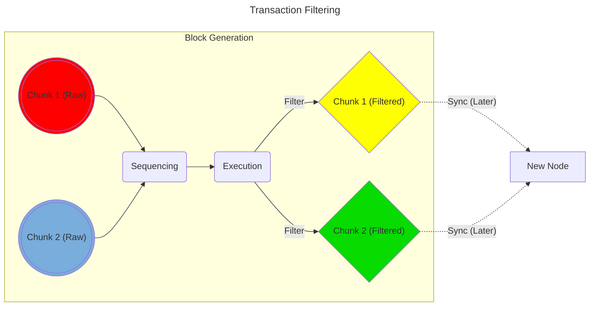
```mermaid
---
title: Transaction Filtering
---
graph LR;
    classDef red fill:#FF0000;
    classDef yellow fill:#FFFF04;
    classDef blue fill:#79ADDC;
    classDef green fill:#07DB00;
    
    c1r((("Chunk 1 (Raw)"))):::red;
    c1p{"Chunk 1 (Filtered)"}:::yellow;
    c2r((("Chunk 2 (Raw)"))):::blue;
    c2p{"Chunk 2 (Filtered)"}:::green;
    s("Sequencing")
    e("Execution")
    
    subgraph Block Generation
        s-->e;
        c1r-->s;
        e-->|Filter|c1p;
        c2r-->s;
        e-->|Filter|c2p;
    end
    
    n1["New Node"];
    c1p-. Sync (Later) .->n1;
    c2p-. Sync (Later) .->n1;
```

_Depending on the mechanism used to sequence replicated data in the DSMR, it may not be possible to filter invalid transactions if the hashes of originally replicated data are used to secure consensus (and fetching all data is required to finalize data). Vryx relies on Snowman Consensus, which does not perform consensus over or make direct use of replicated data prior to inclusion in a HyperSDK block. This approach also allows for creating a lite chain of replicated data hashes that can then be verifiably fetched from external services, dramatically easing the burden on validators to help new nodes join the network._

## Re-Evaluating the Robustness of Cool Chain with Vryx-Like Features

To understand how these features mitigate the attacks previously discussed, let us imagine that the CC developers learn about Vryx and decide to employ all of the mitigations outlined in this work after a cabal of adversarial users attack.

### Resolved: Duplicate Transactions

The first attack adversarial users performed on CC, and to which we previously recognized the ideas of Mir-BFT as a valid solution, was to issue duplicate transactions. Because Vryx partitions transactions by account to different builders (and can even sub-partition transactions within an account), it is not optimal for 2 profit-maximizing builders to include the same transaction (as only 1, assuming they actually are bounded to the account at the time, will be executed). Issuing the same transaction to all builders will result in said transaction getting dropped on all but 1 profit-maximizing builder. If a transaction is included by a non-compliant builder that was not partitioned to issue said transaction, it will be skipped during execution. This all means that the only way to get a transaction replicated by more than 1 profit-maximizing builder is to issue multiple transactions, which all pay fees or are fraud proven.

### Resolved: Conflicting Transactions

The second attack adversarial users performed on CC was issuing conflicting transactions to different builders. These transactions had different transaction IDs but because they shared the same nonce, only 1 of the conflicting set could actually be executed. Because Vryx transactions do not have nonces and cannot be made to conflict, such that only 1 of a set will be executed even if an account has sufficient funds to pay for all executions, this attack is no longer possible by construction. Recall, account epochs have non-overlapping windows for transaction assignment using expiry times so the same transaction cannot be included in multiple epochs.

### Resolved: Fund Exhaustion

The third attack adversarial users performed on CC was fund exhaustion. In this attack, adversarial users would issue a batch of transactions with monotonically increasing nonces to a validator. In the first transaction, the issuer sends all of the account's funds to another account they control and renders all other transactions as non-executable (no funds remaining to pay fees). With Vryx, any transactions that cannot pay fees are used as fraud proofs to claim an account's previously locked and non-withdrawable bond. As long as profit-maximizing builders do not replicate transactions that pay more fees than an account's bond covers, they will always receive at least the amount of fees that the transactions would have paid if valid. This means that a virtual machine, via its canonical transaction format, does not need to indicate the full amount an account could spend of the native token if included.

### Resolved: Combining Conflicting Transactions and Fund Exhaustion

Because it is neither possible to increase iTPS by issuing conflicting transactions or by exhausting an account's funds without paying some fee or bond to profit-maximizing builders, combining such attacks is no longer effective at increasing iTPS.

### Resolved: Indefinitely Persisting Invalid Transactions

Transactions that were never executed nor used as an account fraud proof are eventually dropped from all nodes with Vryx. New nodes syncing CC will only need to fetch and execute valid transactions, which means that the amount of data that needs to be persisted and served by nodes is only a fraction of what it would be without Vryx even if all builders were not profit-maximizing.

## Integrating Vryx with the HyperSDK: High-Level Sketch

In this section, we elaborate on how one would specifically employ Vryx on the HyperSDK. We assume that the HyperSDK is running Snowman Consensus, which doesn't take advantage of any of the artifacts generated during the replication of transaction data to reduce the overhead of consensus. However, this approach does allow the HyperSDK to maintain an external "lite chain" of hashes of replicated data that nodes can sync prior to fetching replicated data. This ensures data fetched is filtered and allows it to be verifiably fetched from external sources (like cloud-native services) rather than from other nodes on the network. This approach is not required to employ Vryx but is a nice optimization that can be used to reduce the bandwidth requirements of nodes on the network.

### Types

#### Block

```text
{
    ParentBlock: ids.ID
    ParentState: ids.ID
    
    Height: uint64
    Timestamp: uint64
    
    ExecutedChunks: []ids.ID
    TransactionsRoot: ids.ID
    OutgoingWarpRoot: ids.ID
    
    AvailableChunks: []ChunkCertificate
}
```

`AvailableChunks` is all `ChunkCertificates` with at least 66% + 1 of stake signatures. `ExecutedChunks` is all `Chunks` that were executed in the block. There is a configurable delay between referencing a `Chunk` for execution and actually executing it to allow nodes that do not yet have the chunk to fetch it. `TransactionsRoot` includes all executed and successful transactions across `ExecutedChunks`. It can be used by any lite client that wants to verify that a particular transaction was processed in a block without needing to fetch any of the replicated data. `OutgoingWarpRoot` is all outgoing messages, useful for proving [Avalanche Warp Messages](https://docs.avax.network/learn/avalanche/awm) on other chains (rather than importing all messages one-by-one). For now, `ParentState` is updated on each block. In the future, this could be adjusted to be computed on some regular cadence instead (batch root generation over the state transitions of Y blocks can be much more efficient but can introduce lead to some blocks taking longer to process, if the root is generated in that block). We include state roots in the block so state syncing nodes can update the root of the state they are syncing as blocks are finalized. This leads to faster state sync (don't need to process a long chain of blocks on termination) and ensures validators don't need to retain old state to which peers may try to sync.

#### Chunk

```text
{
    Producer: ids.ShortID
    Expiry: uint64
    Beneficiary: Address
    
    Transactions: []Transaction
    
    Signer: BLSPublicKey
    Signature: BLSSignature
}
```

Validators can emit a configurable number of `Chunks` per second (limited by `Expiry`). `Beneficiary` is some `Address` that will receive a portion of the fee revenue from the `Chunk`, if it is included in the chain. `Address` is also used as the recipient of any account bond distributions. `Signer` is included in the chunk so that recipients can generate a `ChunkFault` if a builder sends conflicting `Chunks`.

#### Chunk Signature

```text
{
    Chunk: ids.ID
    Producer: ids.ShortID
    Expiry: uint64
    
    Signer: BLSPublicKey
    Signature: BLSSignature
}
```

Upon receiving a `Chunk`, validators will persist it, sign it, and send the signature back to the builder. If a validator sends more than the allowed number of chunks per second, validators will only sign the first they receive. `Signature` is then aggregated in `ChunkCertificate` when queueing a `Chunk` to be executed in a block.

#### Chunk Certificate

```text
{
    Chunk: ids.ID
    Producer: ids.ShortID
    Expiry: uint64
    
    Signers: BitSet
    Signature: BLSSignature
}
```

`ChunkCertificate` is the object actually included in the `AvailableChunks` array of a block. `Signature` is a BLS Multi-Signature over `<Chunk, Producer, Expiry>`. `ChunkCertificates` must have at least 66% + 1 of stake signatures to be included in a block. To incentivize builders to replicate to more than just 66% + 1 of validators before issuing a `ChunkCertificate`, the fee issued to the `Beneficiary` is proportional to the stake weight that signs the `Chunk`. If some validators are unwilling to sign a broadcast `Chunk`, builders can retaliate by not signing their `Chunks`.

#### Executed Chunk

```text
{
    Chunk: ids.ID
    Beneficiary: Address
    
    Transactions: []Transaction
    WarpResults: BitSet
}
```

`Executed Chunks` only contain transactions that were executed in a block and its hash is the canonical hash used for long-term persistence. `WarpResults` is an array of bits indicating whether included Avalanche Warp Messages were verified. This prevents nodes from needing to re-verify BLS Multi-Signatures when bootstrapping (and fetching historical validator sets from the P-Chain).

#### Chunk Request

```text
{
    Chunk: ids.ID
}
```

Nodes can fetch either `AvailableChunks` or `ExecutedChunks` near the processing tip of the chain. After a configurable period of time, nodes can only fetch `ExecutedChunks`. The inclusion of `ExecutedChunks` in `Blocks` allows nodes to compile a list of `Chunks` to fetch to generate the current state and then verifiably fetch them from external services (like cloud-native storage) rather than from other nodes on the network. 

#### Chunk Fault

```text
{
    Producer: ids.ShortID
    Expiry: uint64
    Signer: BLSPublicKey
    
    ChunkA: ids.ID
    SignatureA: BLSSignature
    
    ChunkB: ids.ID
    SignatureB: BLSSignature
}
```

If a builder signs conflicting chunks, a `ChunkFault` can be posted that penalizes malicious builders for subverting replication.

### Pulling Everything Together: Vryx Walkthrough

In Vryx, HyperSDK builders listen for transactions from users that are partitioned to them and bundle syntactically valid transactions into batches which we refer to as `Chunks`:

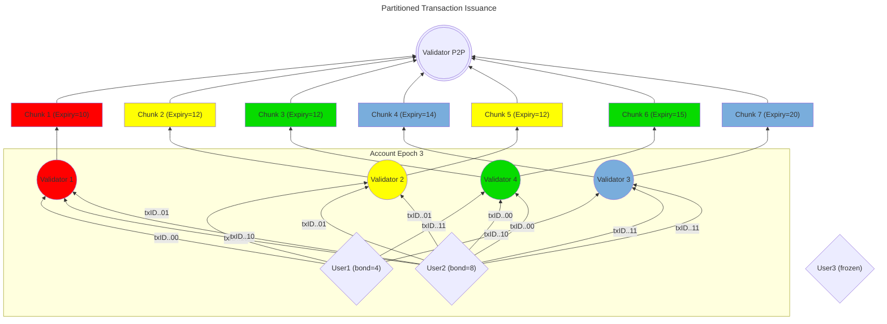
```mermaid
---
title: Partitioned Transaction Issuance
---
graph BT;
    classDef red fill:#FF0000;
    classDef yellow fill:#FFFF04;
    classDef blue fill:#79ADDC;
    classDef green fill:#07DB00;
    classDef grey fill:#D5D5D4;
    
    c1["Chunk 1 (Expiry=10)"]:::red;
    c2["Chunk 2 (Expiry=12)"]:::yellow;
    c3["Chunk 3 (Expiry=12)"]:::green;
    c4["Chunk 4 (Expiry=14)"]:::blue;
    c5["Chunk 5 (Expiry=12)"]:::yellow;
    c6["Chunk 6 (Expiry=15)"]:::green;
    c7["Chunk 7 (Expiry=20)"]:::blue;

    v1((Validator 1)):::red;
    v1-->c1;
    v2((Validator 2)):::yellow;
    v2-->c2;
    v2-->c5;
    v3((Validator 3)):::blue;
    v3-->c4;
    v3-->c7;
    v4((Validator 4)):::green;
    v4-->c3;
    v4-->c6;
    p2p(((Validator P2P)));
    c1-->p2p;
    c2-->p2p;
    c3-->p2p;
    c4-->p2p;
    c5-->p2p;
    c6-->p2p;
    c7-->p2p;
    
    subgraph Account Epoch 3
        user1{"User1 (bond=4)"};
        user1-->|txID..00|v1;
        user1-->|txID..01|v2;
        user1-->|txID..10|v3;
        user1-->|txID..11|v4;

        user2{"User2 (bond=8)"};
        user2-->|txID..10|v1;
        user2-->|txID..01|v2;
        user2-->|txID..11|v3;
        user2-->|txID..00|v4;
        user2-->|txID..10|v1;
        user2-->|txID..01|v2;
        user2-->|txID..11|v3;
        user2-->|txID..00|v4;
    end
    
    user3{"User3 (frozen)"};
```

These builders then send these `Chunks` to other validators and accumulate BLS signatures from them acknowledging that they persisted each `Chunk`:

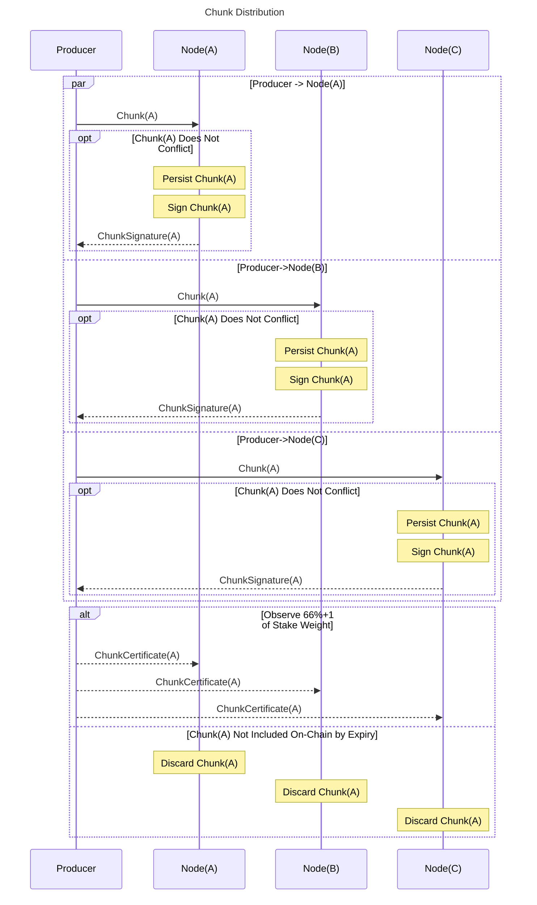
```mermaid
---
title: Chunk Distribution
---
sequenceDiagram
    participant Producer
    participant Node(A)
    participant Node(B)
    participant Node(C)
    par Producer -> Node(A)
        Producer->>Node(A): Chunk(A)
        opt Chunk(A) Does Not Conflict
            Note over Node(A): Persist Chunk(A)
            Note over Node(A): Sign Chunk(A)
            Node(A)-->>Producer: ChunkSignature(A)
        end
    and Producer->Node(B)
        Producer->>Node(B): Chunk(A)
        opt Chunk(A) Does Not Conflict
            Note over Node(B): Persist Chunk(A)
            Note over Node(B): Sign Chunk(A)
            Node(B)-->>Producer: ChunkSignature(A)
        end
    and Producer->Node(C)
        Producer->>Node(C): Chunk(A)
        opt Chunk(A) Does Not Conflict
            Note over Node(C): Persist Chunk(A)
            Note over Node(C): Sign Chunk(A)
            Node(C)-->>Producer: ChunkSignature(A)
        end
    end
    alt Observe 66%+1<br> of Stake Weight
        Producer-->>Node(A): ChunkCertificate(A)
        Producer-->>Node(B): ChunkCertificate(A)
        Producer-->>Node(C): ChunkCertificate(A)
    else Chunk(A) Not Included On-Chain by Expiry
            Note over Node(A): Discard Chunk(A)
            Note over Node(B): Discard Chunk(A)
            Note over Node(C): Discard Chunk(A)
    end
```

As soon as a validator collects signatures from 66% of stake + 1, a `ChunkCertificate` can be created and included in a `Block` by any builder. However, builders are incentivized to distribute data to and collect more than the minimum attestation weight because the fees they collect from sequenced `Chunks` scales based on the % of stake included in the `ChunkCertificate` broadcast.

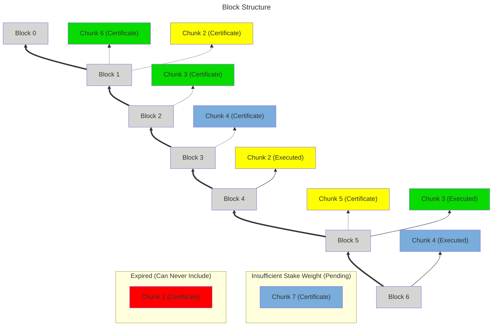
```mermaid
---
title: Block Structure
---
graph BT;
    classDef red fill:#FF0000;
    classDef yellow fill:#FFFF04;
    classDef blue fill:#79ADDC;
    classDef green fill:#07DB00;
    classDef grey fill:#D5D5D4;
    
    b0["Block 0"]:::grey;
    b1["Block 1"]:::grey;
    b2["Block 2"]:::grey;
    b3["Block 3"]:::grey;
    b4["Block 4"]:::grey;
    b5["Block 5"]:::grey;
    b6["Block 6"]:::grey;

    b6==>b5;
    b5==>b4;
    b4==>b3;
    b3==>b2;
    b2==>b1;
    b1==>b0;
    
    b1-.->c6a;
    b1-.->c2a;
    b2-.->c3a;
    b3-.->c4a;
    b4-->c2e;
    b5-.->c5a
    b5-->c3e;
    b6-->c4e;
    
    c1a["Chunk 1 (Certificate)"]:::red;
    c2a["Chunk 2 (Certificate)"]:::yellow;
    c2e["Chunk 2 (Executed)"]:::yellow;
    c3a["Chunk 3 (Certificate)"]:::green;
    c3e["Chunk 3 (Executed)"]:::green;
    c4a["Chunk 4 (Certificate)"]:::blue;
    c4e["Chunk 4 (Executed)"]:::blue;
    c5a["Chunk 5 (Certificate)"]:::yellow;
    c6a["Chunk 6 (Certificate)"]:::green;
    c7a["Chunk 7 (Certificate)"]:::blue;
    
    subgraph "Insufficient Stake Weight (Pending)"
        c7a;
    end
    
    subgraph "Expired (Can Never Include)"
        c1a;
    end
```

To provide time for validators that have not yet heard of a `Chunk` to fetch it from the 66% + 1 that claim to have it, `Chunks` are not executed as soon as they are included and instead are executed after a configurable delay. If this was not the case, some malicious builder could include a `Chunk` that wasn't very well distributed and force the chain to sputter while the 33% - 1 remaining stake rush to fetch it to verify the `Block`. The sputter can be made worse if the builder meant to produce the next block is in this 33% - 1 set (as their build would then be delayed).

The fortunate byproduct of this "sequence ahead" design is that this also allows execution to run ahead of the block that the result must be posted in (this sort of flexibility again allows for better pipelining). Additionally, maintaining a chain of `Chunk` hashes instead of linking `Chunks` together allows them to be sequenced in any order (no need to verify transactions on top of linked parents, the less data dependencies the better) and allows for syncing a "lite chain" of data from nodes but relying on external providers for verifiable fetching of filtered data (which is also linked in each block after execution).

In a nutshell, node operation looks something like this:

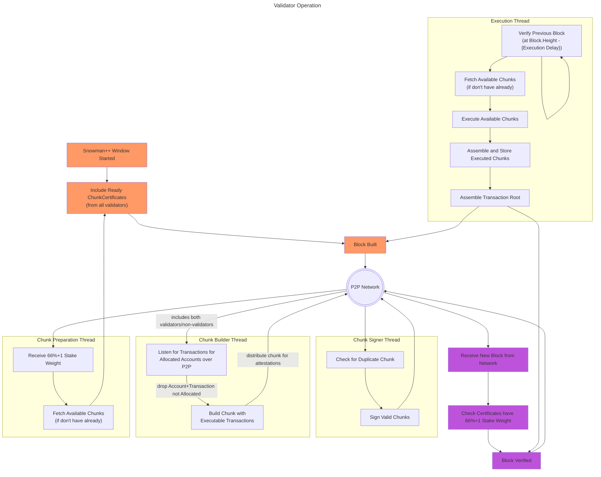
```mermaid
---
title: Validator Operation
---
graph TD;
    start["Snowman++ Window Started"]
    verify["Verify Previous Block<br>(at Block.Height - {Execution Delay})"]
    fetch["Fetch Available Chunks<br>(if don't have already)"]
    fetch2["Fetch Available Chunks<br>(if don't have already)"]
    execute["Execute Available Chunks"]
    dup["Check for Duplicate Chunk"]
    sign["Sign Valid Chunks"]
    certificates["Include Ready ChunkCertificates<br>(from all validators)"]
    assemble["Assemble and Store Executed Chunks"]
    root["Assemble Transaction Root"]
    listen["Listen for Transactions for<br>Allocated Accounts over P2P"]
    chunk["Build Chunk with<br>Executable Transactions"]
    p2p((("P2P Network")))
    receiveCertificates["Receive 66%+1 Stake Weight"]
    receiveBlock["Receive New Block from Network"]
    checkCertificates["Check Certificates have 66%+1 Stake Weight"]
    blockBuilt["Block Built"]
    blockVerified["Block Verified"]
    classDef orange fill:#f96
    classDef purple fill:#be53db
    
    p2p-->|includes both validators/non-validators|listen;
    p2p-->dup;
    subgraph Execution Thread
        verify-->verify;
        verify-->fetch;
        fetch-->execute;
        execute-->assemble;
        assemble-->root;
    end
    subgraph Chunk Signer Thread
        dup-->sign;
    end
    sign-->p2p;
    subgraph Chunk Builder Thread
        listen-->|drop Account+Transaction not Allocated|chunk;
    end
    p2p --> receiveCertificates
    subgraph Chunk Preparation Thread
        receiveCertificates-->fetch2;
    end
    chunk-->|distribute chunk for attestations|p2p;
    fetch2-->certificates;
    start:::orange-->certificates;
    certificates:::orange-->blockBuilt:::orange;
    root-->blockBuilt;
    blockBuilt-->p2p;
    
    p2p-->receiveBlock:::purple;
    receiveBlock-->checkCertificates:::purple;
    checkCertificates-->blockVerified:::purple;
    root-->blockVerified;
    blockVerified-->p2p;
```

From the perspective of the average user, issuing a transaction on a Vryx-Supported HyperSDK would looks like this:

```mermaid
---
title: Life of a Transaction
---
sequenceDiagram
    participant User
    participant API Node
    participant Validator(B)
    participant Network
    User ->> API Node: Transaction(T)
    Note over API Node: Determine Issuer<br>for Transaction(T).Sponsor
    API Node ->> Validator(B): Transaction(T)
    Note over Validator(B): If Transaction(T).Sponsor<br>is Not Assigned to Validator<br>or Sponsor is Frozen, Drop.
    Validator(B) -->> Network: Include Transaction(T) in Chunk
    loop Wait For Transaction(T)
        Network -->> API Node: Receive Accepted Block(X)
        API Node ->> Network: ChunkRequest(X^A)
        API Node ->> Network: ChunkRequest(X^B)
        Network -->> API Node: ExecutedChunk(X^A)
        Network -->> API Node: ExecutedChunk(X^B)
    end
    Note over API Node: Wait for Transaction(T) or<br>Observe Block with<br> Timestamp > Transaction(T).Expiry
    API Node -->> User: TransactionStatus(T)
```

Just like Bitcoin, anyone can run their own "API Node" and propagate transactions directly to block builders. Block builders, using the mechanisms previously described, can then replicate transactions they know will pay fees.

### Account Abstraction Compatibility

Fee payers in Vryx must have non-revokable verification, meaning that the fee payer for a transaction cannot become invalid (and thus not accountable) for a transaction between the time a builder replicates a transaction and when it is sequenced (included and executed in a `Block`). If this was possible, such a transaction would be indistinguishable from a syntactically invalid transaction and a builder could not claim the bond of the fee payer (if we did not do this, any builder could submit a transaction for an account with an invalid signature and potentially claim its bond).

This restriction, however, could pose a challenge for any HyperSDK builders that want to support [account abstraction](https://metamask.io/news/latest/account-abstraction-past-present-future/), where the rules for how an account authorizes a transaction may be defined in a smart contract and/or change over time. If an account modifies the rules for how it authorizes transactions (by updating the smart contract that defines the account), it would be possible for an adversarial user to launch an attack similar to the "Fund Exhaustion" attack on CC, with the exception that the account bond could not be claimed.

A straightforward workaround for HyperSDK builders that are willing to rely on transaction relayers (or a hot-cold account setup) to pay fees is to separate the transaction action authorization from the fee paying authorization. The inner action authorization could remain a complex and updatable mechanism while the outer fee paying mechanism could be a simple signature that has unchanging authorization status and never holds too many funds (just enough to pay fees). This would allow users to rely on advanced and modifiable security mechanisms to secure the vast majority of their funds but would not jeopardize the stability of the network.

A more complex fix, assuming users do not want to separate their funds into multiple accounts or rely on external relayers (who may take the loss if authorization status changes instead of the network), is to provide time-based upgrades for smart contracts used for transaction authorization. Just how builders are expected to be able to look up the "bond status" of any account, they can be expected to look up the latest authorization status of some account. Users could stage updates to their authorization logic but such a change would not take effect until account epoch + 2 to ensure any transactions in-flight could still be used by builders as valid account fraud proofs. Given that users will not likely update these credentials very often, this is a reasonable tradeoff for the flexibility provided. Once a new contract is active, old contracts could be cleaned up to avoid ever-growing contract deployment state. To avoid putting a large burden on the HyperSDK to map different contract versions, it might also make sense to require users to explicitly reference the contract version they are interacting with in their transactions (this also avoids subtle behavior changes that could cause bugs if unnoticed).

### Estimated Replication Capacity

Using some quick back-of-the-napkin math, we can estimate the replication efficiency and expected capacity of Vryx under a hypothetical parameterization. We assume the following parameters:

```text
* Validators = 2000
* Average Tx Size = 400 B
* Max Chunk Size = 2 MB
* Max Block Size = 2 MB
* Len(Chunk Certificate) == Len(Chunk Executed) 
```

This yields the following replication capacity (assuming sufficient hardware can be deployed to replicate and execute all transactions):

```text
* Max Size Per Chunk Certificate = <32, 20, 8, 2000/8, 96> = 406 B
* Max Chunks Per Block (ChunkCertificate [Available] + ids.ID [Executed]) = 2 MB/438 B = ~4500 Chunks
* Max Tx Capacity Per Block = 4500 * 2MB/400B = ~22M
* Max Data Bandwidth Finalized Per Block = 4500 * 2 MB = ~9 GB (72 Gb/block)
```

_The max replication capacity presented above could be lifted by increasing the max block size to something greater than 2MB but it is likely that **many** other bottlenecks (most likely within execution performance) will be hit before ever needing to increase this size._

When considering a single block with 300k transactions, we estimate the following bandwidth usage (assuming transactions are broadcast uniformly to all validators):

```text
* Inbound Transaction Data from Users Per Validator = 300000/2000 * 400 B = 60 KB
* Inbound Transaction Data from Other Validators = 300000 * 400 B - 60 KB = 120 MB (960 Mb)
* Inbound Signature Data from Other Validators = (48 B + 96 B) * 2000 = 288 KB
* Outbound Transaction Data to Other Validators = 60 KB * 2000 = 120 MB (960 Mb)
* Block Size = 406B * 2000 = 812 KB
```

_Note, transaction replication between validators is symmetric and no validator is required to do more work than other validators. Block distribution occurs via a combination of push and pull gossip and may lead to some validators serving more requests than others but this should not surpass 10-15 block disseminations in expectation (an additional 12.2 MB of outgoing validator bandwidth usage)._

## Status: Under Development

The integration of Vryx with the HyperSDK is currently underway. When a Proof-of-Concept of the implementation is complete, a collection of reproducible performance tests that show how Vryx behaves in different scenarios (including environments with a large percentage of adversarial users) will be released. It is expected that Vryx will perform as well as other DSMR constructions in benign environments and will outperform them in adversarial environments, like the one presented for CC.

## Future Work

It would be interesting to explore whether the set of changes introduced by Vryx (account fraud proofs, temporal account partitioning, nonce-less transactions) are stricter than necessary to mitigate all of the attacks explored on DSMR. The best way to determine this would probably be to prove some impossibility results about DSMR robustness, namely what it is possible to defend against without an ability to perform semantic verification. This could all be done as part of a larger effort to formalize the ideas presented here for submission at an academic conference.

On a different note, the previous presentation of Vryx leaves a massive optimization off the table: the ability to use the artifacts generated during reliable broadcast to reduce the overhead of consensus. The total performance of the system could likely be improved by exploring this direction if there is still a way to prune invalid transaction from the chain history in this setup.

## Acknowledgements

Thanks to [Stephen Buttolph](https://twitter.com/stephenbuttolph), [Aaron Buchwald](https://twitter.com/AaronBuchwald), [Dhruba Basu](https://twitter.com/dhrubabasu_), and [Michael Kaplan](https://twitter.com/Michael_Kaplan1) for spending countless hours discussing DSMR at-large and for reviewing Vryx. You all made Vryx much better than I could have on my own.
